# Freddie Mac SFLLD 기반 24개월 신용위험 점수화·순위화·등급화 프로젝트

> **프로젝트 목적**\
> Freddie Mac Single-Family Loan-Level Dataset(SFLLD)의 대출 실행 시점
> 정보를 이용하여, 각 대출이 최초 상환 시점 이후 24개월 안에 본
> 프로젝트에서 정의한 **중대한 신용사건(`Target_24M=1`)**을 경험할
> 상대적 위험을 점수화하고 순위화한다.\
> 최종 모델은 10개 변수로 구성된 CatBoost이며, 내부 보류 Test와 이후
> 시점의 Chronological Validation에서 위험 순위화 성능을 검증하였다.
>
> **중요한 범위 제한**\
> 이 프로젝트는 현재 상태에서 "정확한 개별 PD(probability of default)를
> 제공하는 운영형 Early Warning System"이라고 정의하지 않는다. 보다
> 정확하게는 **대출 실행 시점의 24개월 신용위험 scoring / ranking /
> risk-tiering 프로젝트**이다. 또한 현재 최종 10F 결과는 **Regular-PIT
> 거시변수**를 사용한 benchmark 결과이며, 프로젝트에서 별도로 구축한
> Strict/LS publication-lag-safe macro set을 사용한 최종 모델 재학습은
> 아직 완료하지 않았다.

------------------------------------------------------------------------

# 목차

1. [프로젝트 개요](#1-프로젝트-개요)
2. [연구 질문과 분석 설계](#2-연구-질문과-분석-설계)
3. [데이터 출처](#3-데이터-출처)
4. [데이터 처리 파이프라인](#4-데이터-처리-파이프라인)
5. [Target_24M 정의와 표본 구성](#5-target_24m-정의와-표본-구성)
6. [Geography 및 거시경제 데이터 결합](#6-geography-및-거시경제-데이터-결합)
7. [결측치 처리](#7-결측치-처리)
8. [Feature Engineering](#8-feature-engineering)
9. [최종 10F 변수](#9-최종-10f-변수)
10. [Train / Test / Chronological Validation 설계](#10-train--test--chronological-validation-설계)
11. [모델 비교 및 최종 CatBoost 선정](#11-모델-비교-및-최종-catboost-선정)
12. [Learning Curve와 일반화 성능 진단](#12-learning-curve와-일반화-성능-진단)
13. [Cumulative Gains, 위험 순위화 및 Calibration](#13-cumulative-gains-위험-순위화-및-calibration)
14. [SHAP 기반 모델 해석](#14-shap-기반-모델-해석)
15. [7F vs 10F: 거시경제 변수 Ablation](#15-7f-vs-10f-거시경제-변수-ablation)
16. [고정 위험등급과 신규 대출 평가](#16-고정-위험등급과-신규-대출-평가)
17. [시간 외 Validation에서의 위험등급 특성](#17-시간-외-validation에서의-위험등급-특성)
18. [Leakage / PIT 감사 결과](#18-leakage--pit-감사-결과)
19. [프로젝트의 한계](#19-프로젝트의-한계)
20. [현재 결론](#20-현재-결론)
21. [향후 작업](#21-향후-작업)
22. [참고 자료 및 문헌](#22-참고-자료-및-문헌)

------------------------------------------------------------------------

# 1. 프로젝트 개요

본 프로젝트는 **Freddie Mac Single-Family Loan-Level Dataset (SFLLD)**을 기반으로, 대출 실행 시점에 이용 가능한 차주·대출·지역·거시경제 정보를 활용하여 **향후 24개월 내 중대한 신용사건의 상대적 위험을 점수화하고 순위화하는 모델**을 구축한다. [[1]](#ref-1)

본 프로젝트의 핵심은 단순한 이진 분류 정확도가 아니다. `Target_24M=1`의 발생률이 1% 미만인 희소 사건이므로, 다음 질문을 중심으로 모델을 평가한다.

1. 실제 사건 대출을 비사건 대출보다 높은 위험점수에 배치할 수 있는가?
2. 실제 사건이 모델이 식별한 상위 위험군에 얼마나 집중되는가?
3. 시간적으로 이후에 실행된 대출에서도 위험 순위화 성능이 유지되는가?
4. 차주·대출 특성에 지역 및 거시경제 정보를 추가했을 때 추가적인 예측 정보가 존재하는가?
5. 신규 대출에 대해 미래 population의 분포를 기다리지 않고 과거 Train에서 고정한 기준으로 일관된 위험등급을 부여할 수 있는가?

전체 scoring 구조는 다음과 같다.

```text
신규 대출의 10개 입력 변수
        ↓
Frozen Preprocessing
        ↓
저장된 CatBoost 모델
        ↓
Model Risk Score
        ↓
Train에서 고정한 Score Cutoff
        ↓
Very High / High / Medium / Low
        ↓
Risk Ranking / Review Priority
```

> **범위:** 현재 모델은 개별 대출의 정확한 절대 PD를 제공하는 production-grade 시스템이 아니라, **24개월 신용위험의 상대적 scoring / ranking / tiering framework**로 정의한다.

---

# 2. 연구 질문과 분석 설계

전체 분석은 세 가지 핵심 연구 질문을 중심으로 구성하였다.

## 2.1 24개월 신용위험 예측

**Q1. 대출 실행 시점의 정보만으로 향후 24개월 신용위험을 구분할 수 있는가?**

FICO, DTI, CLTV, 금리, 차주 수와 지역·거시경제 정보를 결합하여 CatBoost 모델을 학습하였다.

## 2.2 시간 외 일반화

**Q2. 시간적으로 이후에 실행된 대출에서도 위험 순위화 성능이 유지되는가?**

- **Development cohort:** 2014-01 ~ 2017-03
- **Chronological Validation:** 2017-04 ~ 2018-03

을 사용하여 시간 이동 이후의 성능을 별도로 평가하였다.

## 2.3 거시경제 변수의 추가 가치

**Q3. 거시경제 정보는 차주·대출·지역 정보 위에 추가적인 예측 정보를 제공하는가?**

동일한 7개 기본 변수를 사용하는 **7F No-Macro 모델**과 3개의 macro feature를 추가한 **10F 모델**을 비교하였다.

```text
7F Base Features
├── FICO_Score
├── Original_DTI
├── Original_CLTV
├── Original_Interest_Rate
├── Number_of_Borrowers
├── DTI_Missing
└── Spatial_Cluster_Region

             + 3 Macro Features
                     ↓

10F
├── 위 7개 변수
├── Housing_HPI_Growth_12M
├── BLS_Unemployment_Rate_Change_12M_Final
└── Regular_MSA_Macro_Cluster_A
```

현재 README에서 보고하는 7F vs 10F ablation은 **Regular-PIT macro specification**을 기준으로 한다.

Strict/LS publication-lag-safe macro를 사용한 최종 재학습 및 ablation은 후속 검증 과제로 남겨두었다.

---

# 3. 데이터 출처

본 프로젝트는 Freddie Mac 대출자료를 중심으로 FHFA, BLS 및 Census geography 자료를 결합하였다.

## 3.1 Freddie Mac Single-Family Loan-Level Dataset

Freddie Mac SFLLD의 **origination data**와 **monthly performance history**를 결합하였다. [[1]](#ref-1)

주요 사용 정보는 다음과 같다.

| 구분 | 주요 변수 |
|---|---|
| Borrower | FICO, DTI, Number of Borrowers |
| Loan | LTV / CLTV, Original UPB, Interest Rate |
| Geography | Property geography, MSA |
| Time | First Payment Date |
| Performance | Monthly Delinquency Status |
| Exit | Zero Balance Code, REO-related status |

이 자료를 기반으로 24개월 이내의 중대한 신용사건을 나타내는 `Target_24M`을 구성하였다.

## 3.2 FHFA House Price Index

지역별 주택가격 환경을 반영하기 위해 **FHFA House Price Index (HPI)**를 사용하였다. [[2]](#ref-2)

최종 10F 모델에는 다음 변수가 포함된다.

```text
Housing_HPI_Growth_12M
```

동일 geography `g`에서 12개월 주택가격 변화율은 개념적으로 다음과 같이 정의한다.

$$
\mathrm{HPI\_Growth}_{g,t}^{12M}
=
\frac{\mathrm{HPI}_{g,t}}
{\mathrm{HPI}_{g,t-12M}}
-1
$$

분기 자료에서는 동일 geography 내 **4-quarter lag**를 사용하여 계산하였다.

## 3.3 BLS 노동시장 자료

지역 노동시장 상황을 반영하기 위해 **U.S. Bureau of Labor Statistics (BLS)**의 실업률 및 고용 관련 시계열을 결합하였다. [[3]](#ref-3)

최종 10F 모델에는 다음 변수가 포함된다.

```text
BLS_Unemployment_Rate_Change_12M_Final
```

동일 geography `g`에서:

$$
\Delta UR_{g,t}^{12M}
=
UR_{g,t}
-
UR_{g,t-12M}
$$

로 정의한다.

## 3.4 Census / Historical Geography Reference

Freddie Mac의 historical MSA identifier와 외부 macro dataset의 geography definition이 항상 직접 일치하지 않기 때문에 Census 및 historical geography reference를 추가로 사용하였다. [[4]](#ref-4) [[5]](#ref-5)

프로젝트 내부 원자료 위치:

```text
data/raw_data/census_govgeographies/
```

이 자료는 단순한 현재 MSA lookup이 아니라 **시간에 따라 변화한 metropolitan-area definition을 reconciliation하기 위한 근거자료**로 사용하였다.

---

# 4. 데이터 처리 파이프라인

전체 데이터 처리 및 모델링 계보는 다음과 같다.

```text
17 sample_YYYY.zip
약 812,500 loans
        ↓
Origination + Monthly Performance 결합
        ↓
Target_24M 생성
        ↓
Censored / 불확실 관측 제외
        ↓
약 713,000 modeling observations
        ↓
기간별 Cohort 분리
        ↓
Missingness Audit
        ↓
Train-only Missing Treatment
        ↓
Historical Geography Reconciliation
        ↓
FHFA / BLS Macro Merge
        ↓
Spatial / Macro Feature Engineering
        ↓
Regular / Strict-PIT Candidate Matrices
        ↓
ML-ready Development = 160,003
ML-ready Validation  = 49,038
        ↓
Internal Train / Test Split
        ↓
7F / 10F CatBoost
        ↓
Ranking / SHAP / Macro Ablation / Risk Tiering
```

현재 README에서 보고하는 최종 **10F CatBoost 결과는 Regular-PIT macro matrix를 사용한 benchmark 결과**이다.

---

# 5. Target_24M 정의와 표본 구성

## 5.1 Target 정의

`Target_24M`은 **First Payment Date 이후 24개월 이내**에 본 프로젝트에서 정의한 중대한 신용사건이 발생했는지를 나타내는 binary target이다.

관찰 기간은:

$$
m \in \{0,1,\ldots,23\}
$$

이다.

다음 사건 중 하나라도 관측되면:

$$
\mathrm{Target}_{24M}=1
$$

로 정의한다.

### ① 90일 이상 연체

$$
DQ_m \ge 3
$$

### ② REO

24개월 performance window 내 REO 상태가 관측된 경우.

### ③ 불량 Zero Balance 종료

```text
Zero Balance Code ∈ {02, 03, 09}
```

따라서 전체 target rule은 개념적으로:

$$
Y_i
=
\mathbb{I}
\left(
\exists\,m\in\{0,\ldots,23\}:
DQ_{i,m}\ge3
\;\lor\;
REO_{i,m}=1
\;\lor\;
ZB_{i,m}\in\{02,03,09\}
\right)
$$

로 표현할 수 있다.

반면:

```text
Zero Balance Code = 01
```

은 정상적인 payoff / benign exit로 처리하여 사건으로 정의하지 않았다.

## 5.2 최종 모델링 표본

현재 최종 모델링에는 별도의 **Strict label audit로 축소한 표본을 사용하지 않았다.**

실제 모델링 pipeline에 사용된 표본은 다음과 같다.

| Cohort | First Payment Period | Loans | Events | Event Rate |
|---|---|---:|---:|---:|
| Development | 2014-01 ~ 2017-03 | **160,003** | **919** | **0.5744%** |
| Chronological Validation | 2017-04 ~ 2018-03 | **49,038** | **380** | **0.7749%** |

Development cohort는 다시 stratified random split하였다.

| Split | Loans | Events | Event Rate |
|---|---:|---:|---:|
| Internal Train | **128,002** | **735** | **0.5742%** |
| Internal held-out Test | **32,001** | **184** | **0.5750%** |

Split 조건:

```text
test_size    = 0.20
stratify     = Target_24M
random_state = 3217
```

따라서 README에서 보고하는 CatBoost, SHAP, Learning Curve, 7F vs 10F ablation 및 위험 순위화 결과는 모두 이 표본 정의를 기준으로 한다.

## 5.3 Class Imbalance

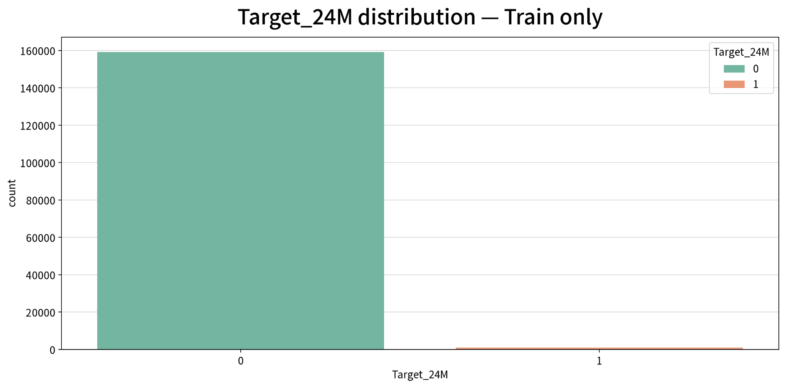

`Target_24M=1`의 사건율은 Development cohort에서 **0.5744%**에 불과하다.

따라서 Accuracy만으로 모델을 평가하지 않고 다음과 같은 rare-event 및 ranking metric을 함께 사용하였다.

- ROC-AUC
- PR-AUC
- Recall / Precision / F1
- KS
- Top-K Capture
- Lift
- Cumulative Gains

---

# 6. Geography 및 거시경제 데이터 결합

본 프로젝트에서 가장 많은 데이터 엔지니어링이 필요했던 부분은 **각 대출의 geography와 historical macroeconomic data를 `(지역, 시간)` 기준으로 연결하는 과정**이었다.

## 6.1 MSA를 단순 Merge할 수 없는 이유

Freddie Mac의 historical MSA code와 외부 macro dataset의 geography definition은 항상 1:1로 대응하지 않는다.

시간이 지나면서:

- CBSA / MSA definition이 변경되고,
- Metropolitan Division이 분리 또는 통합되며,
- historical code와 current code가 다를 수 있고,
- one-to-many / many-to-many 관계가 발생할 수 있다.

따라서 단순히:

```text
Freddie MSA = Current MSA Code
```

로 처리할 수 없다.

## 6.2 Direct MSA Merge

먼저 원 MSA code로 직접 연결 가능한 observation을 결합하였다.

| Source | Matched MSA Codes | Loan-weighted Coverage |
|---|---:|---:|
| BLS direct | 415 / 455 | **93.7433%** |
| FHFA quarterly metro direct | 410 / 455 | **90.6048%** |

대부분의 대출은 direct mapping으로 처리할 수 있었지만, 일부 historical MSA는 추가 reconciliation이 필요하였다.

초기 reconciliation 대상:

```text
45 MSA codes
58,574 loans
```

## 6.3 Historical Geography Reconciliation

Direct mapping이 불가능한 경우 historical geography 자료를 이용하여 추가 reconciliation을 수행하였다.

Evidence hierarchy는 다음과 같다.

1. Census historical delineation membership [[4]](#ref-4) [[5]](#ref-5)
2. FHFA historical metro source [[2]](#ref-2)
3. FHFA multi-division metro source
4. FHFA 2009→2013 CBSA crosswalk
5. Census 2020→2023 CBSA relationship
6. FHFA definition-change reference

핵심 원칙은 **불확실한 historical code를 현재 CBSA에 강제로 매핑하지 않는 것**이었다.

```text
Unique / Unambiguous Evidence
        ↓
Canonical Mapping

Ambiguous / One-to-Many / Many-to-Many
        ↓
No Forced Mapping
```

## 6.4 Geography Fallback

MSA 수준에서 macro value를 안정적으로 확보할 수 없는 경우 가능한 더 넓은 geography로 fallback하였다.

Housing macro의 개념적 hierarchy는:

```text
MSA / MSAD
    ↓
ZIP3
    ↓
State
```

이다.

이 방식은 macro coverage를 높이지만, 모든 대출이 동일한 geographic granularity를 갖는 것은 아니라는 trade-off가 존재한다.

---

# 7. 결측치 처리

결측치는 전체 dataset에서 일괄적으로 median 또는 mode를 계산하여 처리하지 않았다.

핵심 원칙은 다음과 같다.

> **데이터에서 학습되는 preprocessing parameter는 Development/Train data에서만 추정하고, 이후 Test 및 Chronological Validation에는 고정하여 적용한다.**

```text
Train
├── Median Fit
├── Category Vocabulary Fit
├── Scaler Fit
└── K-Means Fit
        ↓
Frozen Preprocessing
        ↓
Test / Validation
Transform Only
```

## 7.1 주요 결측 현황

약 713,000건의 modeling dataset에 대한 주요 missingness audit 결과는 다음과 같다.

| Variable | Missing | Missing Rate | Treatment |
|---|---:|---:|---|
| `FICO_Score` | 100 | ~0.0140% | Train median |
| `MI_Percentage` | 3 | ~0.00042% | Train median |
| `Number_of_Units` | 62 | ~0.00870% | Train median |
| `Original_CLTV` | 11 | ~0.00154% | Train median |
| `Original_LTV` | 10 | ~0.00140% | Train median |
| `Original_DTI` | 78,026 | **~10.9433%** | Missing indicator + Train median |
| `First_Time_Homebuyer` | 13 | ~0.00182% | Explicit Missing category |
| `MSA` | 89,555 | **~12.5603%** | Geography treatment / Missing |

최종 10F에 포함되지 않는 변수도 전체 preprocessing audit 과정에서 함께 관리하였다.

## 7.2 DTI Missingness

`Original_DTI`는 약 **10.94%**가 결측이며, 단순 median imputation만으로 처리하지 않았다.

먼저 missing indicator를 생성하였다.

$$
\mathrm{DTI\_Missing}_i
=
\mathbb{I}
\left(
\mathrm{Original\_DTI}_i
\text{ is missing}
\right)
$$

이후 Development/Train에서 계산한 median:

```text
Original_DTI median = 35
```

를 결측값에 적용하였다.

$$
\mathrm{Original\_DTI}_i^{*}
=
\begin{cases}
\mathrm{Original\_DTI}_i,
& \text{if observed},\\
35,
& \text{if missing}
\end{cases}
$$

따라서 모델은 다음 두 경우를 구분할 수 있다.

```text
Observed DTI
Original_DTI = 35
DTI_Missing  = 0
```

```text
Imputed DTI
Original_DTI = 35
DTI_Missing  = 1
```

Train 분석에서 두 집단의 실제 사건율에도 차이가 존재하였다.

| Group | Event Rate |
|---|---:|
| 실제 관측 `DTI = 35` | ~**0.60%** |
| Missing → `35` imputation | ~**1.58%** |

따라서 `DTI_Missing`을 별도 feature로 유지하여 **missingness 자체가 갖는 정보를 보존**하였다.

---

# 8. Feature Engineering

## 8.1 Continuous Feature Transformation

연속형 후보 변수에 대해 skewness와 distribution을 확인하고 log transformation 필요성을 검토하였다.

EDA 단계에서 일부 후보 변수는 `log`, `log1p`, `reverse_log1p` 대상으로 분류되었지만, **최종 10F에 포함된 연속형 변수는 모두 transformation이 필요하지 않은 변수였다.**

따라서 최종 10F에서는 별도의 log transformation을 적용하지 않았다.

## 8.2 Categorical Features

최종 10F의 categorical feature는 다음 세 개이다.

```text
DTI_Missing
Spatial_Cluster_Region
Regular_MSA_Macro_Cluster_A
```

Category definition은 Train에서 고정하고, 이후 split에서 Train에 존재하지 않았던 category는 `Unknown`으로 처리하였다.

## 8.3 Spatial_Cluster_Region

`Spatial_Cluster_Region`은 ZIP3 기반의 geographic information을 8개의 coarse spatial regime으로 압축한 feature이다.

### Step 1. ZIP3 대표 좌표

각 ZIP3에 Census geographic reference의 대표 위도·경도를 연결하였다. [[7]](#ref-7)

$$
ZIP3_i
\rightarrow
(\phi_i,\lambda_i)
$$

이는 개별 property의 실제 좌표가 아니라 **ZIP3-level representative coordinate**이다.

### Step 2. 구면좌표 변환

위도·경도를 radian으로 변환한 후 3차원 unit vector로 변환하였다.

$$
x_i=\cos(\phi_i)\cos(\lambda_i)
$$

$$
y_i=\cos(\phi_i)\sin(\lambda_i)
$$

$$
z_i=\sin(\phi_i)
$$

따라서:

$$
\mathbf{g}_i=(x_i,y_i,z_i)
$$

를 구성하였다.

### Step 3. Train-only K-Means

```python
KMeans(
    n_clusters=8,
    random_state=42,
    n_init=20
)
```

을 Train에서만 fit하였다.

각 관측은:

$$
C_i
=
\underset{k\in\{1,\ldots,8\}}{\arg\min}
\left\|
\mathbf{g}_i-\boldsymbol{\mu}_k
\right\|_2^2
$$

에 따라 가장 가까운 centroid에 할당된다.

Validation에는 새로운 K-Means를 fit하지 않고 **Train에서 학습한 centroid로 assignment만 수행**하였다.

### Step 4. Region Label

K-Means cluster ID 자체에는 의미가 없으므로 centroid와 포함 ZIP3 / State를 검토하여 사람이 읽을 수 있는 frozen region label을 부여하였다.

| Cluster | Region Label | 대표 State |
|---:|---|---|
| 0 | Central Plains | CO, MN, KS, IA, MO, NE, ND, WI |
| 1 | Southeast | FL, GA, NC, SC, AL, TN, VA, MS |
| 2 | Southwest & California | CA, AZ, UT, NV, NM, CO, WY |
| 3 | Pacific Northwest | WA, OR, ID, MT, AK, WY |
| 4 | Midwest | IL, MI, OH, IN, WI, TN, MO, KY |
| 5 | Northeast & Mid-Atlantic | NY, PA, VA, NJ, MA, MD, CT, NH |
| 6 | South-Central | TX, LA, OK, AR, MO, KS, MS, TN |
| 7 | Pacific Islands | HI, GU |

> `Spatial_Cluster_Region`은 정확한 property location이나 neighborhood risk가 아니라 **coarse geographic regime**으로 해석한다.

## 8.4 Regular_MSA_Macro_Cluster_A

`Regular_MSA_Macro_Cluster_A`는 여러 지역 거시경제 변수를 하나의 **macro regime category**로 압축한 Train-only unsupervised feature이다.

### Macro Vector

MSA `g`, reference period `t`에 대해 A specification은 다음 macro vector를 사용한다.

$$
\mathbf{z}_{g,t}^{(A)}
=
\left[
HPI_{g,t},
\Delta HPI_{g,t}^{12M},
UR_{g,t},
\Delta Emp_{g,t}^{12M},
\Delta UR_{g,t}^{12M}
\right]
$$

즉 다음 정보를 함께 사용한다.

```text
HPI Level
HPI 12M Growth
Unemployment Rate
Employment 12M Growth
Unemployment Rate 12M Change
```

B specification은 별도 후보로 검토하였으나, 최종 10F에서는 **A specification**을 사용하였다.

### Standardization

각 macro feature는 Train에서 계산한 mean과 standard deviation을 이용하여 표준화하였다.

$$
z_{ij}^{std}
=
\frac{
z_{ij}-\mu_j^{Train}
}{
\sigma_j^{Train}
}
$$

Validation에는 동일한 Train statistics를 적용하였다.

### Cluster 수 선택

다음 후보를 비교하였다.

$$
K\in\{2,3,4,5,6\}
$$

Train silhouette score를 기준으로 K를 선택하였으며, 동률일 경우 더 작은 K를 선택하였다.

최종 `Regular_MSA_Macro_Cluster_A`는 **2개 cluster**로 구성되었다.

| Cluster | Train N | Share |
|---:|---:|---:|
| 0 | 77,660 | 48.54% |
| 1 | 82,343 | 51.46% |

K-Means objective는:

$$
\min_{\{\boldsymbol{\mu}_k\}_{k=1}^{K}}
\sum_{i=1}^{n}
\min_{k\in\{1,\ldots,K\}}
\left\|
\mathbf{z}_i^{std}
-
\boldsymbol{\mu}_k
\right\|_2^2
$$

이다.

`Target_24M`은 clustering 과정에 사용하지 않았다.

### Macro Cluster Fallback

Train 160,003건 중 direct MSA macro profile이 존재한 대출은:

```text
128,197 / 160,003
```

이었으며, direct profile이 없는 대출은:

```text
31,806 / 160,003
= 19.878%
```

이었다.

Direct MSA cluster가 없는 경우 **Train의 direct MSA cluster만을 이용하여** 다음 순서로 fallback mapping을 구축하였다.

```text
1. State Macro Cluster × First Payment Year
2. State Macro Cluster
3. Global Train Mode
```

개념적으로:

$$
\hat C_i
=
\begin{cases}
\operatorname{Mode}(C\mid \mathrm{StateCluster},\mathrm{Year}),
& \text{if reliable},\\
\operatorname{Mode}(C\mid \mathrm{StateCluster}),
& \text{otherwise},\\
\operatorname{Mode}(C\mid \mathrm{Train}),
& \text{otherwise}
\end{cases}
$$

Validation target은 이 mapping을 구축하는 데 사용하지 않았다.

다만 fallback assignment에는 approximation error가 존재할 수 있으므로, `Regular_MSA_Macro_Cluster_A`는 **macro regime을 나타내는 유용한 categorical feature이지만 완전한 direct MSA measurement로 해석하지 않는다.**

---

# 9. 최종 10F 변수

최종 CatBoost 모델은 다음 10개 feature를 사용한다.

| Category | Feature | Type / Treatment |
|---|---|---|
| Borrower | `FICO_Score` | Continuous |
| Borrower | `Original_DTI` | Continuous; missing → Train median 35 |
| Loan | `Original_CLTV` | Continuous |
| Loan | `Original_Interest_Rate` | Continuous |
| Borrower | `Number_of_Borrowers` | Numeric |
| Missingness | `DTI_Missing` | Categorical |
| Geography | `Spatial_Cluster_Region` | Categorical |
| Housing Macro | `Housing_HPI_Growth_12M` | Continuous |
| Labor Macro | `BLS_Unemployment_Rate_Change_12M_Final` | Continuous |
| Macro Regime | `Regular_MSA_Macro_Cluster_A` | Categorical |

실제 feature specification:

```python
FEATURES_10F = [
    "FICO_Score",
    "Original_DTI",
    "Original_CLTV",
    "Original_Interest_Rate",
    "Number_of_Borrowers",
    "DTI_Missing",
    "Spatial_Cluster_Region",
    "Housing_HPI_Growth_12M",
    "BLS_Unemployment_Rate_Change_12M_Final",
    "Regular_MSA_Macro_Cluster_A",
]
```

Categorical features:

```python
CATEGORICAL_FEATURES = [
    "DTI_Missing",
    "Spatial_Cluster_Region",
    "Regular_MSA_Macro_Cluster_A",
]
```

최종 10F의 연속형 feature에는 별도의 log transformation을 적용하지 않았다.

---

# 10. Train / Test / Chronological Validation 설계

모델의 내부 일반화와 시간 외 일반화를 구분하기 위해 다음과 같은 평가 구조를 사용하였다.

```text
                         Development Cohort
                         2014-01 ~ 2017-03
                         N = 160,003
                         Events = 919
                         Event Rate = 0.5744%
                               │
                  ┌────────────┴────────────┐
                  │                         │
          Internal Train            Internal Test
             80%                        20%
          N = 128,002                N = 32,001
          Events = 735               Events = 184
                  │
                  │
                  └──── Model Development
                              │
                              │ 시간 이동
                              ▼
                  Chronological Validation
                     2017-04 ~ 2018-03
                       N = 49,038
                       Events = 380
                     Event Rate = 0.7749%
```

Internal split은 다음과 같이 수행하였다.

```python
train_test_split(
    ...,
    test_size=0.20,
    stratify=y,
    random_state=3217
)
```

### Internal held-out Test

동일한 Development period 내에서 모델의 일반화 성능을 확인한다.

### Chronological Validation

시간적으로 이후에 실행된 대출에 모델을 적용하여 **시간 이동 이후에도 상대적 위험 순위화가 유지되는지** 확인한다.

다만 프로젝트 개발 과정에서 Validation 결과를 여러 feature 및 model comparison에서 관찰하였으므로, 이 cohort를 **완전히 untouched한 final holdout**으로 표현하지 않는다.

---

# 11. 모델 비교 및 최종 CatBoost 선정

본 프로젝트에서는 처음부터 CatBoost를 최종 모델로 가정하지 않고, **Logistic Regression, LightGBM, CatBoost를 포함한 여러 머신러닝 모델과 feature combination을 비교**하였다.

Logistic Regression은 상대적으로 작은 Train–CV gap을 보여 안정적인 일반화 특성을 보였지만, 최종 feature set과 거시경제 변수를 함께 사용했을 때 **CatBoost가 희소 신용사건의 risk ranking에서 더 높은 성능을 보였다.**

Feature selection 과정에서는 feature importance와 모델 성능을 함께 검토하였으며, 기여도가 제한적이었던 `HARP_High_Leverage`를 제외하고 최종 **10F feature set**을 구성하였다.

## 11.1 CatBoost 설정

CatBoost의 주요 hyperparameter는 초기 탐색에서 다음과 같이 선정하였다. 

```python
{
    "model__depth": 4,
    "model__iterations": 500,
    "model__learning_rate": 0.03
}
```

이후 CatBoost 실험에서는 해당 parameter를 **고정하여 사용**하였다. 이를 통해 feature set을 변경할 때 hyperparameter 차이의 영향을 최소화하고, feature 구성에 따른 성능 변화를 비교하였다.

최종적으로 **10F CatBoost**를 본 프로젝트의 최종 모델로 선정하였다. CatBoost는 categorical feature를 직접 처리하면서 borrower, loan, geography 및 macroeconomic feature 사이의 비선형 관계와 interaction을 반영할 수 있다는 장점이 있다. [[14]](#ref-14)

다만 Logistic Regression이 더 작은 generalization gap을 보였으므로, CatBoost의 선정은 단순히 안정성만을 기준으로 한 것이 아니라 **generalization과 predictive ranking performance를 함께 고려한 결과**이다.

## 11.2 평가 지표

`Target_24M=1`이 1% 미만인 severe class-imbalance problem이므로 Accuracy 하나에 의존하지 않고 여러 지표를 함께 평가하였다. 특히 불균형 데이터에서는 ROC-AUC와 함께 Precision–Recall 기반 평가가 중요하다. [[15]](#ref-15)

| 평가 목적 | Metric |
|---|---|
| **Overall Ranking** | ROC-AUC |
| **Rare-event Ranking** | PR-AUC / Average Precision |
| **Score Separation** | KS |
| **Threshold Classification** | Recall, Precision, F1 |
| **Risk Prioritization** | Top-5% / Top-20% Capture |
| **Risk Concentration** | Lift |
| **Portfolio Screening** | Cumulative Gains |

**Accuracy는 class imbalance의 영향을 크게 받기 때문에 보조적인 진단 지표로만 사용하였다.**

최종 모델은 단일 metric이 아니라 **Train–CV–Test 일반화, ROC-AUC, PR-AUC, Capture/Lift 및 Chronological Validation 성능을 종합적으로 고려하여 선정하였다.**

구체적인 최종 모델의 일반화 성능은 [#12](#12-learning-curve와-일반화-성능-진단), 위험 순위화 결과는 [#13](#13-cumulative-gains-위험-순위화-및-calibration), 7F와 10F의 macro ablation 결과는 [#15](#15-7f-vs-10f-거시경제-변수-ablation)에서 각각 확인한다.

------------------------------------------------------------------------

# 12. Learning Curve와 일반화 성능 진단

최종 10F tuned CatBoost 모델이 학습 데이터에 과도하게 적합되었는지 확인하기 위해 **Learning Curve**와 Train–CV–Test 성능을 함께 분석하였다.

본 프로젝트의 Development cohort에서 `Target_24M=1` 사건은 총 **919건 / 160,003건(0.5744%)**으로 매우 희소하다. 내부 model-fitting 표본의 사건율은 **0.5742%(735/128,002)**, Internal held-out test는 **0.5750%(184/32,001)**였으며, 이후 Chronological Validation에서는 **0.7749%(380/49,038)**로 나타났다.

이처럼 사건 비율이 1% 미만인 심한 불균형 데이터이므로, 일반화 성능은 Accuracy 또는 단일 지표만으로 판단하지 않고 **ROC-AUC, PR-AUC, F1, Recall, Precision**을 함께 확인하였다.

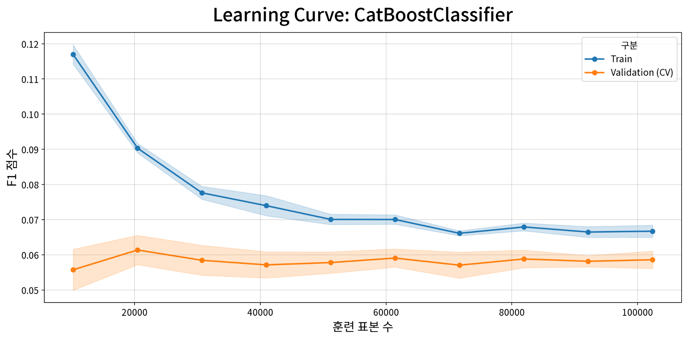

## 12.1 Learning Curve

학습 표본이 작은 구간에서는 Train F1이 약 **0.117**로 높게 나타났으나, 학습 데이터가 증가하면서 빠르게 감소하여 큰 표본 구간에서는 약 **0.067 수준으로 수렴**하였다.

반면 5-fold CV F1은 대체로 **0.057~0.061 범위**에서 유지되었다.

즉, 작은 표본에서는 Train과 CV 사이에 비교적 큰 차이가 존재하지만, 표본 수가 증가하면서 그 차이가 감소한다.

큰 표본 구간에서는 Train과 CV 곡선이 완전히 일치하지는 않지만 두 곡선 모두 비교적 안정적인 수준에 도달한다. 따라서 학습 데이터가 증가함에 따라 초기의 강한 training fit이 완화되고, F1 기준 일반화 격차가 감소하는 패턴으로 해석하였다.

또한 CV F1이 데이터 증가와 함께 지속적으로 크게 상승하는 형태는 아니다. 따라서 단순히 동일한 분포의 학습 데이터를 추가하는 것만으로 큰 성능 향상을 기대하기보다는, 이후 개선에서는 **feature quality, rare-event modeling 및 시간적 안정성**이 중요하다.

---

## 12.2 Train–CV–Test 성능 비교

최종 10F tuned CatBoost의 성능은 다음과 같다.

| Metric | Train | 5-Fold CV | CV Std. | Internal Test |
|---|---:|---:|---:|---:|
| F1 | 0.0650 | 0.0576 | ±0.0025 | **0.0625** |
| PR-AUC | 0.1009 | 0.0374 | ±0.0046 | **0.0477** |
| ROC-AUC | 0.8521 | 0.8286 | ±0.0085 | **0.8554** |
| Recall | 0.5170 | 0.4531 | ±0.0205 | **0.4728** |
| Precision | 0.0347 | 0.0307 | ±0.0013 | **0.0335** |
| Accuracy | 0.9146 | 0.9148 | ±0.0011 | **0.9185** |

Train–CV 절대 차이는 다음과 같다.

| Metric | Train − CV |
|---|---:|
| F1 | +0.0074 |
| PR-AUC | **+0.0635** |
| ROC-AUC | +0.0234 |
| Recall | **+0.0639** |
| Precision | +0.0039 |
| Accuracy | −0.0002 |

이 결과는 지표에 따라 서로 다른 일반화 특성이 존재함을 보여준다.

---

## 12.3 ROC-AUC: 비교적 안정적인 위험 순위화

ROC-AUC는

- Train: **0.8521**
- 5-Fold CV: **0.8286 ± 0.0085**
- Internal Test: **0.8554**

로 나타났다.

Train에서 CV로 이동하면서 ROC-AUC가 **0.0234** 감소하지만, CV에서도 약 0.83 수준을 유지하며 Internal Test에서는 0.8554를 기록하였다.

따라서 **상대적으로 위험한 대출을 더 높은 점수에 배치하는 discrimination / ranking 능력은 Train, CV 및 Internal Test에서 비교적 안정적으로 유지**되었다.

특히 Internal Test가 Train보다 오히려 약간 높은 ROC-AUC를 보였으므로, 적어도 ROC-AUC 기준에서는 내부 held-out sample에서 뚜렷한 성능 붕괴가 관찰되지 않았다.

다만 Internal Test는 Development cohort 내부에서 무작위로 분리된 표본이므로, 시간 변화에 대한 일반화는 이후 Chronological Validation 결과와 별도로 확인한다.

---

## 12.4 F1, Recall 및 Precision

F1은 Train **0.0650**에서 CV **0.0576**으로 감소하였고, Internal Test에서는 **0.0625**였다.

Recall은

$$
0.5170
\rightarrow
0.4531
\rightarrow
0.4728
$$

로 Train보다 CV와 Test에서 낮게 나타났다.

반면 Precision은 Train **0.0347**, CV **0.0307**, Test **0.0335**로 세 집단에서 유사한 수준이었다.

본 데이터는 사건 비율이 매우 낮기 때문에 Precision과 F1의 절대값 자체가 낮게 나타난다. 따라서 F1만으로 모델의 전체적인 위험 식별 능력을 판단하지 않고, ROC-AUC, PR-AUC 및 이후의 Top-K Capture와 함께 평가하였다.

또한 F1, Recall, Precision은 본 진단에서 사용한 **decision threshold = 0.015**에 영향을 받는 threshold-dependent metric이라는 점도 고려해야 한다.

---

## 12.5 PR-AUC에서 나타나는 Train–CV 차이

가장 주의해서 해석해야 할 지표는 **PR-AUC**이다.

PR-AUC는 다음과 같이 나타났다.

$$
\text{Train } 0.1009
\rightarrow
\text{CV } 0.0374
$$

Internal Test에서는 **0.0477**이었다.

Train과 CV의 절대 차이는 **0.0635**로, ROC-AUC에서 나타난 차이보다 상대적으로 크다.

PR-AUC는 희소한 positive event를 상위 위험구간에 얼마나 효과적으로 집중시키는지에 민감하기 때문에, 이 차이는 **rare-event discrimination 측면에서 Train 성능이 CV보다 낙관적으로 나타나고 있음**을 보여준다.

따라서 전체 결과를 단순히 **“과적합이 없다”** 또는 **“완벽한 Good Fit”**으로 표현하는 것은 적절하지 않다.

다만 Internal Test PR-AUC는 **0.0477**로 CV 평균 0.0374보다 높았으며, 이후 Chronological Validation에서도 별도의 ranking 성능을 확인하였다. 따라서 PR-AUC의 Train–CV 차이는 모델을 즉시 부적합으로 판단하기보다는 **희소 사건 예측에서 추가적으로 확인해야 할 일반화 차이**로 해석하였다.

---

## 12.6 Accuracy를 중심 지표로 사용하지 않은 이유

Accuracy는 Train, CV, Test에서 각각

- Train: **0.9146**
- CV: **0.9148**
- Internal Test: **0.9185**

로 매우 안정적으로 보인다.

그러나 본 프로젝트에서는 `Target_24M=1` 사건 자체가 매우 희소하다.

따라서 높은 Accuracy는 비사건 대출을 많이 맞히는 것만으로도 얻을 수 있으며, 실제 고위험 대출을 얼마나 효과적으로 식별하는지를 충분히 설명하지 못한다.

이에 따라 Accuracy는 보조적인 진단 지표로만 사용하고, 최종 모델 평가는 주로 다음 지표를 함께 사용하였다.

- **ROC-AUC:** 전체적인 위험 순위 판별 능력
- **PR-AUC:** 희소 positive event 식별 능력
- **F1 / Recall / Precision:** 고정 threshold에서의 분류 성능
- **Cumulative Gains / Capture / Lift:** 고위험 대출 우선순위화 성능
- **Chronological Validation:** 시간적으로 이후의 대출에 대한 성능 확인

---

## 12.7 종합 해석

Learning Curve와 Train–CV–Test 결과를 종합하면 다음과 같이 해석할 수 있다.

**첫째,** 작은 학습 표본에서 나타나는 높은 Train F1은 표본이 증가하면서 빠르게 감소하고, 큰 표본 구간에서는 Train과 CV 성능이 비교적 안정적인 수준으로 수렴한다. 이는 데이터 증가에 따라 초기의 강한 training fit이 완화되는 패턴을 보여준다.

**둘째,** ROC-AUC는 Train **0.8521**, CV **0.8286**, Internal Test **0.8554**로 나타나 **위험 순위화 능력은 Development cohort 내부에서 비교적 안정적으로 유지**되었다.

**셋째,** F1과 Recall에서는 Train에서 CV로 일정한 성능 감소가 존재하지만 Internal Test에서 다시 일부 회복된다.

**넷째,** PR-AUC는 Train **0.1009**에서 CV **0.0374**로 비교적 큰 차이를 보인다. 따라서 희소 사건의 정밀한 식별 측면에서는 Train 성능을 그대로 일반화 성능으로 간주할 수 없다.

**다섯째,** Accuracy는 세 집단에서 안정적으로 보이지만 심한 class imbalance 때문에 최종 모델 평가의 핵심 근거로 사용하지 않는다.

따라서 본 단계의 결론은 다음과 같다.

> **최종 10F CatBoost는 ROC-AUC와 Learning Curve 기준으로 Development cohort 내부에서 비교적 안정적인 위험 순위화 성능을 보였다. 그러나 PR-AUC와 Recall에서는 Train 대비 CV 성능 저하가 존재하므로, 단순히 “과적합이 없다” 또는 “완벽한 Good Fit”이라고 결론내리지 않는다. 최종 일반화 평가는 내부 CV와 Test뿐 아니라 이후 시점의 Chronological Validation, Cumulative Gains 및 Top-K Capture 결과를 함께 고려한다.**

이러한 이유로 다음 절에서는 모델이 시간적으로 이후의 대출에서도 실제 고위험 대출을 상위에 배치할 수 있는지를 **Cumulative Gains와 Chronological Validation**을 통해 추가로 평가한다.

------------------------------------------------------------------------

# 13. Cumulative Gains, 위험 순위화 및 Calibration

최종 10F CatBoost 모델은 개별 대출의 `Target_24M=1` 위험을 얼마나 효과적으로 구분하고, 실제 신용사건이 발생할 가능성이 상대적으로 높은 대출을 얼마나 상위에 배치하는지를 평가하였다.

본 데이터는 `Target_24M=1` 사건 비율이 1% 미만인 심한 불균형 데이터이므로 Accuracy만으로는 모델의 실질적인 위험 식별 능력을 평가하기 어렵다.

따라서 본 절에서는 다음 세 가지 관점에서 최종 모델을 평가하였다.

1. **Discrimination / Ranking**  
   ROC-AUC와 PR-AUC를 통해 사건 대출과 비사건 대출을 구분하는 능력을 평가한다.

2. **Risk Prioritization**  
   Cumulative Gains, Top-K Capture 및 Lift를 통해 높은 위험점수를 받은 대출에 실제 사건이 얼마나 집중되는지를 평가한다.

3. **Probability Calibration**  
   실제 사건율과 calibrated probability를 비교하여 모델의 확률 출력이 실제 관측 위험과 어느 정도 일치하는지를 확인한다.

이 세 가지는 서로 관련되어 있지만 동일한 개념은 아니다. 특히 높은 ROC-AUC 또는 Capture Rate가 개별 대출의 예측확률이 정확하게 보정되었음을 의미하지는 않는다.

---

## 13.1 전체 위험 판별 성능

최종 10F tuned CatBoost의 주요 평가 결과는 다음과 같다.

| 평가 데이터 | N | Events | Event Rate | ROC-AUC | PR-AUC (AP) |
|---|---:|---:|---:|---:|---:|
| Train OOF | 128,002 | 735 | 0.5742% | 0.8296 | 0.0361 |
| Internal held-out test | 32,001 | 184 | 0.5750% | **0.8554** | **0.0477** |
| Chronological Validation | 49,038 | 380 | 0.7749% | **0.8253** | **0.0415** |

Internal held-out test에서 ROC-AUC는 **0.8554**, Chronological Validation에서는 **0.8253**이었다.

Chronological Validation은 모델 개발에 사용된 Development cohort보다 시간적으로 이후인 **2017-04 ~ 2018-03**에 실행된 49,038건의 대출로 구성되어 있다.

이 집단에서도 ROC-AUC가 0.8253으로 나타났다는 것은, 이번 후속 시점의 데이터에서도 실제 사건 대출이 비사건 대출보다 상대적으로 높은 위험점수에 배치되는 **risk ranking 구조가 유지되었음**을 보여준다.

다만 ROC-AUC는 상대적인 순위 판별 능력을 측정하는 지표이다. 따라서 ROC-AUC가 높다는 사실만으로 모델이 출력하는 개별 위험점수가 정확한 사건확률로 calibration되어 있다고 해석하지 않는다.

---

## 13.2 Cumulative Gains

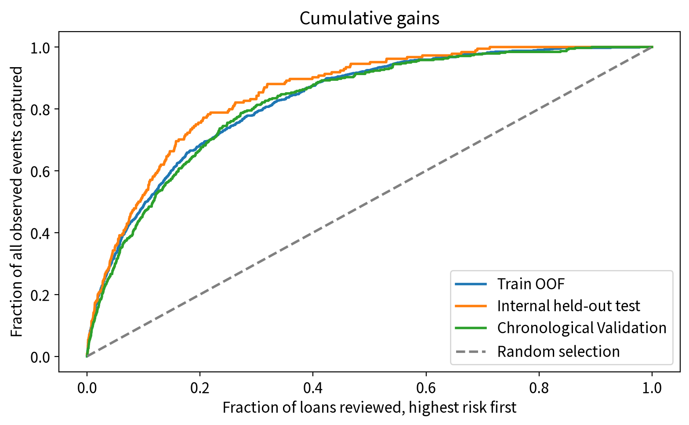

위 그림은 최종 10F CatBoost 모델의 예측 위험점수를 높은 순서대로 정렬한 뒤, 대출 검토 범위를 점차 확대할 때 전체 실제 사건 중 얼마나 많은 사건이 누적해서 포착되는지를 보여준다.

- **Train OOF:** 128,002건의 model-fitting 표본에 대한 Out-of-Fold 예측
- **Internal held-out test:** Development cohort에서 분리된 32,001건의 내부 테스트 표본
- **Chronological Validation:** 2017-04 ~ 2018-03의 후속 대출 49,038건
- **Random selection:** 위험 순위화 정보가 없는 무작위 선택 기준선

그래프의 x축은 **위험점수가 높은 대출부터 검토했을 때의 누적 대출 비율**, y축은 해당 범위에서 포착된 **전체 실제 사건의 누적 비율**을 의미한다.

무작위 선택에서는 전체 대출의 20%를 검토하면 평균적으로 전체 사건의 약 20%를 포착하게 된다. 반면 모델이 실제 위험을 효과적으로 순위화한다면 Cumulative Gains 곡선은 무작위 기준선보다 위에 위치한다.

본 결과에서는 Train OOF, Internal held-out test, Chronological Validation의 세 곡선이 모두 Random selection 기준선보다 명확하게 위에 위치하였다.

특히 Chronological Validation에서도 이러한 패턴이 유지되었다. 이는 실제 사건이 전체 대출에 균등하게 분포되어 있는 것이 아니라, **모델이 높은 위험점수를 부여한 대출에 상대적으로 집중되어 있음**을 보여준다.

---

## 13.3 Top-K Capture와 Lift

Cumulative Gains를 구체적인 수치로 확인하기 위해 각 cohort에서 모델 위험점수 상위 1%, 5%, 10%, 20%를 선택하였다.

**Capture Rate**는 전체 실제 사건 중 선택된 고위험 구간에 포함된 사건의 비율이다.

$$
\mathrm{Capture@k}
=
\frac{\text{Top-k 구간의 실제 사건 수}}
{\text{전체 실제 사건 수}}
$$

**Lift**는 선택된 고위험 구간의 사건율이 전체 cohort 사건율보다 몇 배 높은지를 나타낸다.

$$
\mathrm{Lift@k}
=
\frac{\text{Top-k 구간의 사건율}}
{\text{전체 cohort 사건율}}
$$

주요 결과는 다음과 같다.

| 평가 데이터 | Top 1% Capture | Top 5% Capture | Top 10% Capture | Top 20% Capture |
|---|---:|---:|---:|---:|
| Train OOF | 11.29% | 33.20% | 48.57% | 68.44% |
| Internal held-out test | 11.96% | **35.87%** | **52.17%** | **75.54%** |
| Chronological Validation | 10.00% | **30.00%** | **46.32%** | **66.84%** |

Chronological Validation의 세부 결과는 다음과 같다.

| Top Share | Selected Loans | Captured Events | Event Rate | Capture Rate | Lift |
|---:|---:|---:|---:|---:|---:|
| 1% | 491 | 38 | **7.739%** | 10.00% | **9.99×** |
| 5% | 2,452 | 114 | **4.649%** | **30.00%** | **6.00×** |
| 10% | 4,904 | 176 | **3.589%** | **46.32%** | **4.63×** |
| 20% | 9,808 | 254 | **2.590%** | **66.84%** | **3.34×** |

Chronological Validation 전체에서는 49,038건 중 **380건**의 실제 `Target_24M=1` 사건이 관측되었으며, 전체 사건율은 **0.7749%**였다.

### Top 5%

모델 점수가 가장 높은 상위 5%의 대출은 총 **2,452건**이다. 이 구간에는 전체 380건의 실제 사건 중 **114건**이 포함되어 있었다.

$$
\mathrm{Capture@5\%}
=
\frac{114}{380}
=
30.0\%
$$

즉, 전체 Validation 대출의 **5%를 우선적으로 검토하여 실제 사건의 30.0%를 포착**하였다.

이 구간의 실제 사건율은 **4.649%**로, 전체 Validation 사건율 0.7749%의 약 **6.00배**였다.

### Top 10%

검토 범위를 위험점수 상위 10%인 **4,904건**까지 확대하면 실제 사건 **176건**이 포함된다.

따라서 전체 사건의 **46.32%**를 포착하며, 해당 구간의 사건율은 **3.589%**, Lift는 약 **4.63배**이다.

### Top 20%

위험점수 상위 20%인 **9,808건**까지 검토하면 실제 사건 **254건**이 포함된다.

$$
\mathrm{Capture@20\%}
=
\frac{254}{380}
=
66.84\%
$$

즉,

$$
20\%\ \text{of loans}
\rightarrow
66.84\%\ \text{of observed events}
$$

의 집중 효과가 관찰되었다.

상위 20% 구간의 실제 사건율은 **2.590%**이며, 전체 Validation cohort 대비 Lift는 약 **3.34배**였다.

> **해석 시 주의:** Capture Rate와 Event Rate는 서로 다른 지표이다. 예를 들어 Validation 상위 5%가 전체 사건의 **30.0%를 포착**했다는 것은 해당 대출들의 사건확률이 30%라는 의미가 아니다. 해당 구간 자체의 관측 사건율은 **4.649%**이다.

---

## 13.4 위험등급별 실제 사건율

Top-K 분석을 보다 운영적으로 해석하기 위해 각 평가 cohort 내부의 모델 점수분포를 기준으로 대출을 네 개의 위험구간으로 구분하였다.

- **Very High:** 점수 상위 5%
- **High:** 다음 15%
- **Medium:** 다음 30%
- **Low:** 나머지 50%

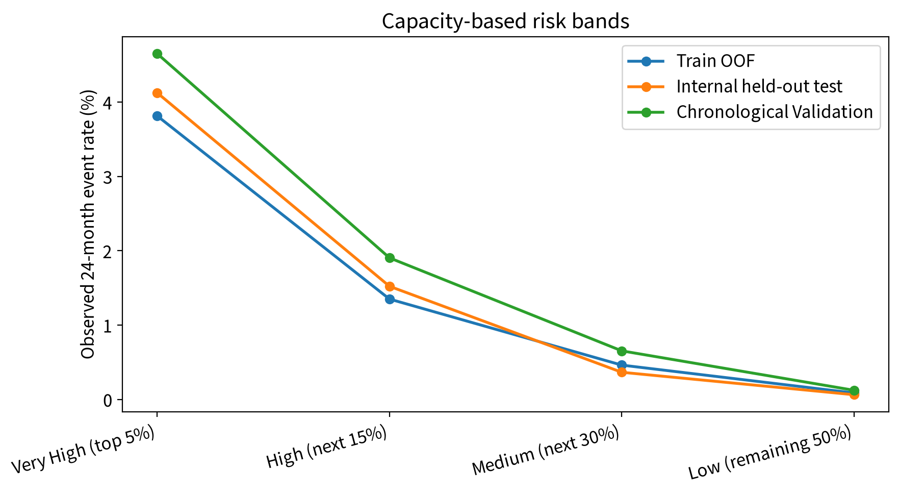

세 평가 집단 모두 **Very High → High → Medium → Low** 순서로 실제 24개월 사건율이 감소하는 명확한 위험 구배를 보였다.

| Dataset | Very High | High | Medium | Low |
|---|---:|---:|---:|---:|
| Train OOF | 3.812% | 1.349% | 0.461% | 0.086% |
| Internal held-out test | 4.122% | 1.521% | 0.365% | 0.063% |
| Chronological Validation | **4.649%** | **1.903%** | **0.653%** | **0.122%** |

Chronological Validation에서는 다음과 같은 위험 구배가 관찰되었다.

$$
4.649\%
\rightarrow
1.903\%
\rightarrow
0.653\%
\rightarrow
0.122\%
$$

Very High 구간의 2,452건에서는 실제 사건 114건이 발생하여 사건율이 **4.649%**였던 반면, Low 구간의 24,519건에서는 30건의 사건이 발생하여 사건율이 **0.122%**였다.

따라서 모델 점수가 높아질수록 실제 24개월 신용사건 발생도 뚜렷하게 증가하며, 이러한 위험 구배가 Chronological Validation에서도 유지되었다.

이는 최종 모델이 단순히 전체 ROC-AUC에서 사건과 비사건을 구분하는 것을 넘어, 대출을 **상대적인 위험 수준에 따라 계층화(risk stratification)**할 수 있음을 보여준다.

> **중요:** 본 절의 Very High / High / Medium / Low는 **각 평가 cohort 내부의 score percentile**을 기준으로 정의한 분석용 위험구간이다. 따라서 이후 신규 대출 적용을 위해 Train에서 사전에 고정하는 절대 score cutoff와는 구분해야 한다.

---

## 13.5 Chronological Validation의 Calibration 진단

좋은 위험 순위화가 곧 정확한 확률 예측을 의미하지는 않는다. [[16]](#ref-16) [[17]](#ref-17)

따라서 Chronological Validation에서는 실제 사건율과 calibrated probability를 **위험구간(risk band)** 및 **score decile** 단위로 비교하였다.

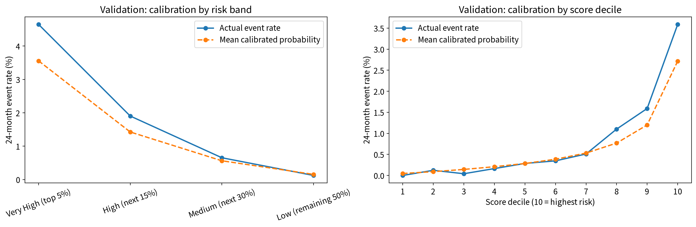

### 13.5.1 위험구간별 Calibration

| Risk Band | Loans | Actual Events | Actual Event Rate | Mean Calibrated Probability | Observed / Expected |
|---|---:|---:|---:|---:|---:|
| Very High | 2,452 | 114 | **4.649%** | **3.557%** | **1.31** |
| High | 7,356 | 140 | **1.903%** | **1.425%** | **1.34** |
| Medium | 14,711 | 96 | **0.653%** | **0.562%** | **1.16** |
| Low | 24,519 | 30 | **0.122%** | **0.154%** | **0.79** |

위험구간에 따른 실제 사건율의 순서는 명확하게 유지되지만, Validation의 고위험 영역에서는 실제 사건율이 평균 calibrated probability보다 높게 나타났다.

Very High 구간에서는 실제 사건율이 **4.649%**인 반면 평균 calibrated probability는 **3.557%**였다.

모델의 확률을 기준으로 계산한 기대 사건 수는 약 **87.2건**이었지만 실제로는 **114건**의 사건이 관측되어, Observed-to-Expected 비율은 약 **1.31**이었다.

High 구간에서도 실제 사건율 **1.903%**가 평균 calibrated probability **1.425%**보다 높았으며, Observed-to-Expected 비율은 약 **1.34**였다.

Medium에서는 차이가 상대적으로 작아졌고, Low에서는 평균 calibrated probability가 실제 사건율보다 약간 높았다.

따라서 Validation에서는 **위험 순서는 유지되지만 고위험 구간의 절대 위험 수준을 다소 낮게 추정하는 현상**이 나타났다.

### 13.5.2 Score Decile별 Calibration

보다 세분화된 score decile에서도 동일한 현상을 확인하였다.

특히 고위험 분위의 결과는 다음과 같다.

| Score Decile | Actual Event Rate | Mean Calibrated Probability | Observed / Expected |
|---:|---:|---:|---:|
| 8 | **1.101%** | 0.768% | 1.43 |
| 9 | **1.591%** | 1.200% | 1.33 |
| 10 | **3.589%** | 2.716% | 1.32 |

최고위험인 **10분위**에서는 4,904건 중 **176건**의 실제 사건이 발생하여 관측 사건율이 **3.589%**였다.

반면 평균 calibrated probability는 **2.716%**였으며, 이에 따른 기대 사건 수는 약 **133.2건**이었다.

실제 176건이 관측되었으므로 Observed-to-Expected 비율은 약 **1.32**였다.

8분위와 9분위에서도 실제 사건율이 평균 calibrated probability보다 높게 나타났다.

따라서 Chronological Validation의 상위 위험영역에서는 모델이 실제 위험을 일정 부분 **과소추정(underestimation)**하는 경향이 확인되었다.

반면 중·저위험 구간에서는 사건 수 자체가 매우 적기 때문에 개별 decile의 작은 변동을 과도하게 해석하지 않는다.

---

## 13.6 Internal Test와 Chronological Validation 비교

| Cohort | ROC-AUC | PR-AUC | Top 5% Capture | Top 20% Capture |
|---|---:|---:|---:|---:|
| Internal held-out test | **0.8554** | **0.0477** | **35.87%** | **75.54%** |
| Chronological Validation | **0.8253** | **0.0415** | **30.00%** | **66.84%** |

Chronological Validation에서는 Internal held-out test에 비해 ROC-AUC, PR-AUC 및 Top-K Capture가 모두 다소 낮아졌다.

그러나 시간적으로 이후에 실행된 별도의 cohort에서도 ROC-AUC **0.8253**을 유지하였으며, 상위 5%에서 전체 사건의 **30.0%**, 상위 20%에서 **66.84%**를 포착하였다.

또한 위험구간별 실제 사건율 역시 Very High에서 Low까지 명확한 순서로 감소하였다.

따라서 모델의 성능이 Development cohort 내부의 random held-out sample에만 국한된 것이 아니라, **이번 Chronological Validation에서도 상대적 위험 순위화 및 위험 계층화 구조가 유지되었음**을 확인하였다.

다만 이 결과만으로 모든 미래 시기 또는 다른 경제환경에서도 동일한 성능이 유지된다고 일반화하지 않는다.

---

## 13.7 Risk Ranking과 Probability Calibration의 구분

앞선 결과를 종합할 때 최종 10F CatBoost 모델의 **상대적 위험 순위화 능력**과 **절대확률 정확도**는 구분하여 해석해야 한다.

### Risk Ranking / Prioritization

Chronological Validation에서는 다음 결과가 확인되었다.

- ROC-AUC: **0.8253**
- Top 5% Capture: **30.0%**
- Top 10% Capture: **46.32%**
- Top 20% Capture: **66.84%**
- Top 5% Lift: **6.00×**
- Very High → High → Medium → Low의 명확한 사건율 구배

따라서 모델은 이번 후속 시점의 대출에서도 **상대적으로 위험한 대출을 높은 점수에 배치하고, 고위험 대출을 우선적으로 식별하는 기능**을 유지하였다.

### Probability Calibration

반면 Chronological Validation의 고위험 영역에서는 실제 사건율이 calibrated probability보다 높았다.

예를 들어:

- Very High: **4.649% actual vs. 3.557% calibrated**
- High: **1.903% actual vs. 1.425% calibrated**
- Score Decile 10: **3.589% actual vs. 2.716% calibrated**

따라서 현재 모델의 calibrated probability를 개별 대출의 정확한 24개월 사건확률로 직접 해석하기에는 주의가 필요하다.

즉,

> **모델은 현재 상대적인 위험 순위화와 위험 우선순위화에는 유용하지만, 개별 대출의 절대 사건확률을 직접적인 의사결정 확률로 사용하기 위해서는 추가적인 시간 외 calibration 검증이 필요하다.**

---

## 13.8 평가용 Percentile과 운영용 고정 Risk Band의 구분

본 절에서 사용한 Top-K 및 위험구간은 각 평가 cohort 내부에서 계산한 **상대적 percentile**이다.

예를 들어 Validation Top 5%는 49,038건의 Validation 대출을 모두 점수화한 뒤, 그 집단 내부에서 점수가 가장 높은 5%를 선택한 것이다.

이는 모델의 **ranking 성능을 평가하기 위한 방법**이다.

반면 실제 신규 대출은 미래 cohort 전체의 점수분포를 미리 알 수 없으며, 개별 대출이 한 건씩 들어올 수도 있다.

따라서 운영 단계에서는 final-model Train-fit score distribution을 이용하여 위험등급의 **절대 score cutoff를 사전에 고정**해야 한다.

두 개념은 다음과 같이 구분한다.

| 구분 | 평가용 Top-K / Risk Band | 운영용 Fixed Risk Band |
|---|---|---|
| 기준 | 각 평가 cohort의 자체 score percentile | final-model Train-fit reference distribution에서 사전 결정한 score cutoff |
| 목적 | 모델의 ranking / stratification 성능 평가 | 신규 대출의 즉시 위험등급 분류 |
| 미래 cohort 전체 필요 | 필요 | 불필요 |
| 신규 대출 1건에 즉시 적용 | 불가능 | 가능 |

따라서 본 절의 Validation Top 5%와 이후 신규 대출 적용에서 사용하는 **Train 기반 Very High cutoff**는 동일한 개념이 아니다.

이 구분은 평가 단계에서 확인한 모델의 순위화 성능을 실제 운영 규칙으로 전환할 때 발생할 수 있는 데이터 누수와 해석상의 혼동을 방지하기 위해 중요하다.

---

## 13.9 핵심 결과

최종 10F CatBoost 모델은 Chronological Validation에서 **ROC-AUC 0.8253**을 기록하였으며, 모델 위험점수 상위 **5%의 대출에서 전체 실제 사건의 30.0%**, 상위 **20%에서 66.84%**를 포착하였다.

또한 Validation 내부의 위험구간별 실제 사건율은

$$
\text{Very High } 4.649\%
>
\text{High } 1.903\%
>
\text{Medium } 0.653\%
>
\text{Low } 0.122\%
$$

로 명확한 위험 구배를 나타냈다.

따라서 이번 Chronological Validation에서는 최종 모델이 시간적으로 이후에 실행된 대출에서도 향후 24개월 신용사건 위험이 상대적으로 높은 대출을 상위에 배치하는 **위험 순위화(risk ranking)**, **검토 우선순위화(risk prioritization)** 및 **위험 계층화(risk stratification)** 기능을 유지하였다.

반면 Calibration 분석에서는 Validation의 고위험 영역에서 실제 사건율이 calibrated probability보다 높게 나타났다. 따라서 **상대적 위험 순위화 성능은 유지되었지만 절대확률 보정에는 일부 시간적 차이가 존재**하였다.

이에 따라 현재 모델의 가장 직접적인 활용 범위는 다음과 같이 정리한다.

> **신규 대출의 상대적 위험 점수화 → Train 기반 고정 cutoff를 이용한 위험등급 분류 → 고위험 대출의 우선 검토**

개별 calibrated probability를 정확한 24개월 사건확률로 직접적인 의사결정에 사용하려면 추가적인 시간 외 calibration 검증 및 필요 시 재보정이 요구된다.

------------------------------------------------------------------------

# 14. SHAP 기반 모델 해석

SHAP 분석은 최종 CatBoost 모델이 각 변수에 부여한 예측 기여도를 해석하기 위해 수행하였다.  
SHAP value가 양수이면 class=1의 예측 log-odds를 증가시키고, 음수이면 감소시킨다.

SHAP은 학습된 모델의 예측 구조를 설명하는 도구이며, 변수와 24개월 신용사건 간의 인과관계를 의미하지 않는다.

---

## 14.1 Global SHAP Importance

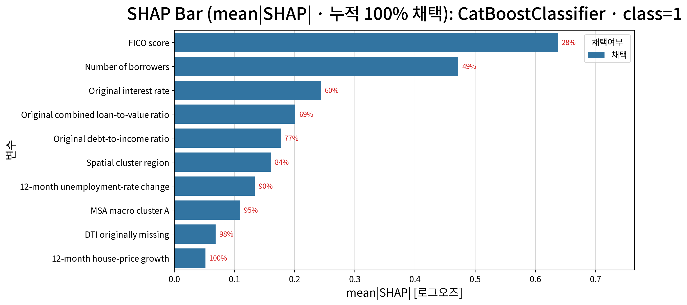

mean absolute SHAP 기준 변수 중요도는 다음과 같다.

| Rank | Feature | Mean \|SHAP\| |
|---:|---|---:|
| 1 | FICO Score | 0.637 |
| 2 | Number of Borrowers | 0.472 |
| 3 | Original Interest Rate | 0.243 |
| 4 | Original CLTV | 0.201 |
| 5 | Original DTI | 0.177 |
| 6 | Spatial Cluster Region | 0.161 |
| 7 | 12M Unemployment-rate Change | 0.134 |
| 8 | MSA Macro Cluster A | 0.109 |
| 9 | DTI Missing | 0.069 |
| 10 | 12M House-price Growth | 0.052 |

FICO Score와 Number of Borrowers가 가장 큰 global contribution을 보였으며,
이후 Original Interest Rate, CLTV, DTI가 주요 대출 특성으로 나타났다.

지역 및 거시경제 변수도 모델에 기여하였다. Spatial Cluster Region은 전체
변수 중 6위였으며, 거시경제 변수 중에서는 12M Unemployment-rate Change가
12M House-price Growth보다 높은 importance를 보였다.

---

## 14.2 SHAP Beeswarm: 기여 방향

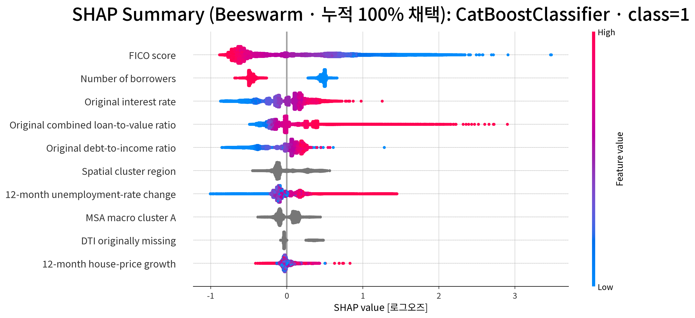

Beeswarm은 변수 중요도뿐 아니라 각 변수값이 예측을 어느 방향으로 이동시키는지를 보여준다.

주요 패턴은 다음과 같다.

- **FICO Score:** 낮은 FICO가 주로 양의 SHAP value와 연결되며, 높은 FICO에서는 음의 방향으로 이동한다.
- **Number of Borrowers:** 1명과 2명 차주의 SHAP contribution이 뚜렷하게 분리되며, 1명은 주로 양의 방향, 2명은 음의 방향을 보인다.
- **Original Interest Rate:** 낮은 금리는 주로 음의 contribution을 보이며, 금리가 상승하면서 양의 방향으로 이동한다.
- **Original CLTV:** 낮은 CLTV에서는 음의 contribution이 우세하지만, CLTV가 증가하면서 양의 contribution이 크게 증가하는 구간이 나타난다.
- **Original DTI:** 단조 관계가 아니라 중간 DTI 구간에서 음의 contribution이 강하고, 높은 DTI 구간에서 다시 양의 방향으로 이동한다.
- **12M Unemployment-rate Change:** 값이 증가할수록 SHAP contribution이 대체로 양의 방향으로 이동한다.

Spatial Cluster Region과 MSA Macro Cluster A는 categorical feature이므로
숫자 코드의 크기 자체를 연속적인 위험 수준으로 해석하지 않는다.

---

## 14.3 주요 변수의 비선형 관계

### FICO Score × Number of Borrowers

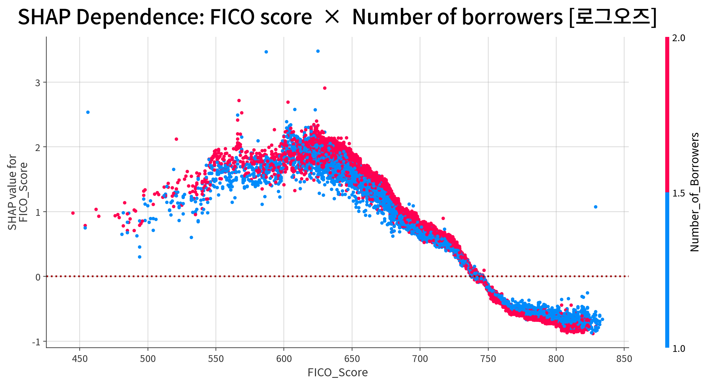

FICO Score는 강한 비선형 관계를 보인다. SHAP contribution은 FICO 600대
초반에서 높은 수준을 보인 후 감소하며, 740 전후에서 0을 통과한다.
이후 높은 FICO 구간에서는 음의 contribution이 유지된다.

동일한 FICO에서도 Number of Borrowers에 따라 SHAP value가 달라져,
FICO의 효과가 차주 수와 함께 변화하는 interaction이 관찰된다.

### Original Interest Rate × FICO Score

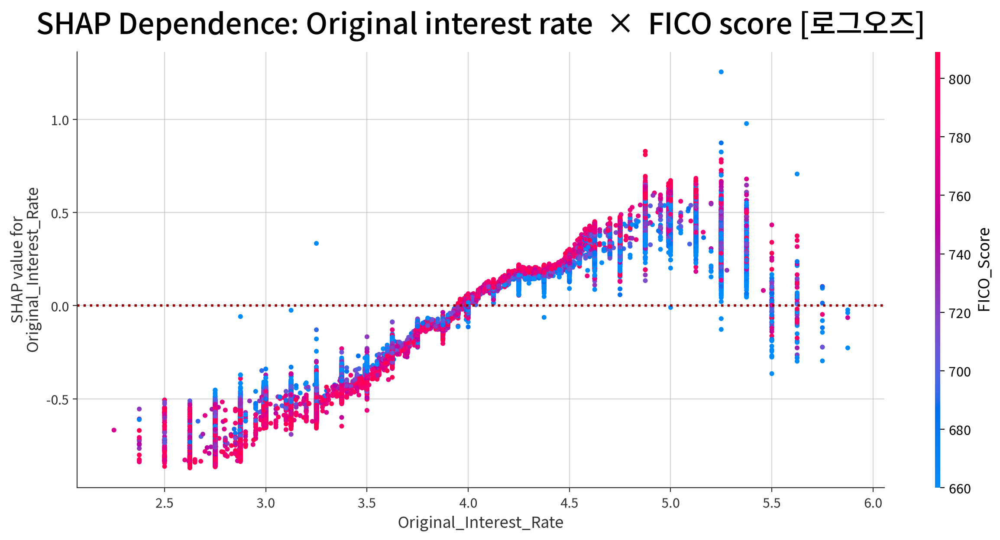

Interest Rate의 contribution은 금리 상승과 함께 전반적으로 증가한다.
3%대의 낮은 금리에서는 SHAP value가 주로 음수이며, 4% 부근에서 0을
통과한 뒤 4.5~5.4% 구간에서 양의 contribution이 뚜렷하게 나타난다.

다만 최고 금리 구간에서는 contribution이 다시 감소하므로 전체 관계는
완전한 단조 증가가 아니다.

### Original CLTV × FICO Score

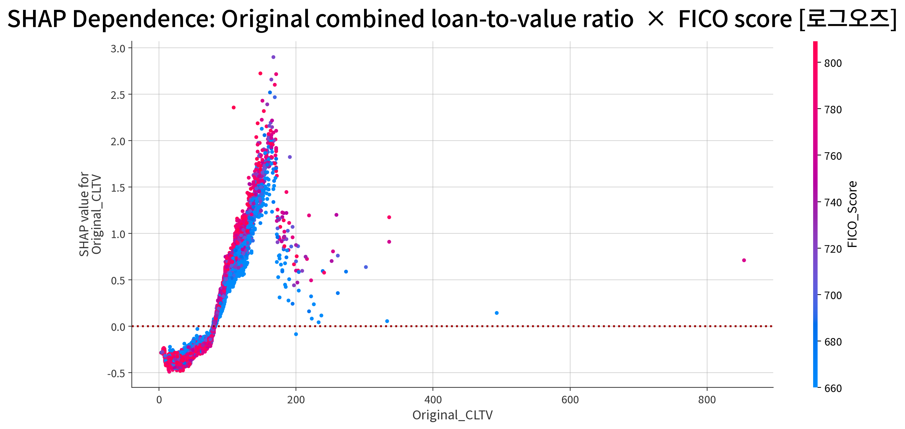

CLTV 역시 강한 비선형 관계를 보인다. 낮은 CLTV에서는 contribution이
음수이지만, CLTV가 80~100 수준을 넘어서면서 양의 방향으로 전환되고
이후 빠르게 증가한다.

높은 CLTV 구간에서는 동일한 CLTV에서도 SHAP value의 분산이 커지며,
FICO 및 다른 대출 특성과의 interaction이 존재함을 보여준다.

### 12M Unemployment-rate Change × House-price Growth

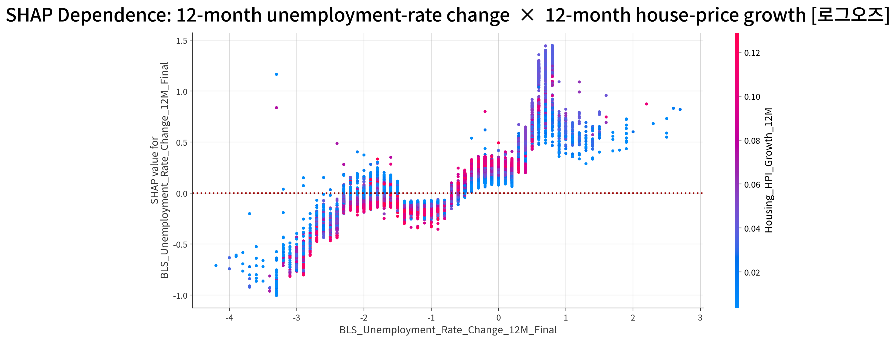

12개월 실업률 변화는 거시경제 변수 중 가장 높은 SHAP importance를 보였다.

실업률 변화가 크게 음수인 구간에서는 contribution도 주로 음수이며,
실업률 변화가 증가하면서 SHAP value가 전반적으로 상승한다. 특히
실업률 변화가 양수인 구간에서는 양의 contribution이 뚜렷하게 나타난다.

동일한 실업률 변화에서도 Housing HPI Growth에 따라 SHAP value가 분산되어
있어, 모델이 두 거시경제 변수를 독립적인 선형 효과로만 사용하지 않음을 보여준다.

---

## 14.4 Spatial Cluster와 주택가격 환경의 상호작용

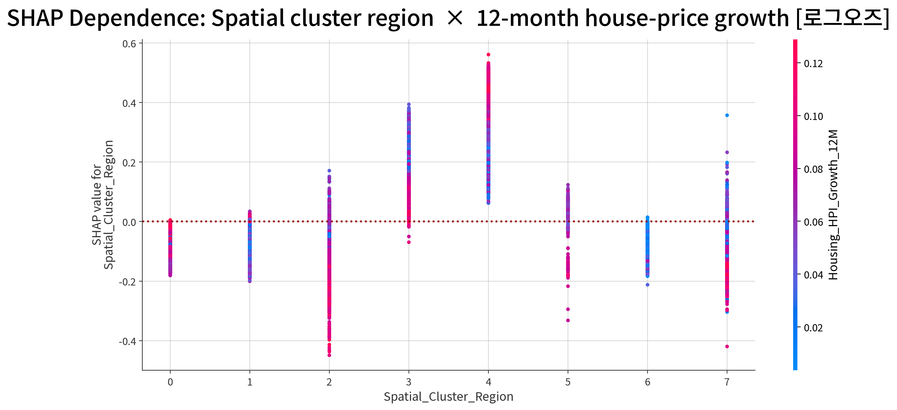

Spatial Cluster의 SHAP contribution은 cluster별로 명확한 차이를 보였다.
Cluster 3과 Cluster 4에서는 SHAP value가 주로 양의 영역에 위치한 반면,
Cluster 0, 1, 2, 5, 6은 주로 음의 영역에 위치하였다. Cluster 7은
양·음의 contribution이 모두 나타나 상대적으로 큰 내부 변동성을 보였다.

그러나 이를 특정 지역 자체가 구조적으로 높은 신용위험을 가진다는 의미로
해석해서는 안 된다. `Spatial_Cluster_Region`은 ZIP3 좌표를 기반으로
Train 데이터에서 비지도 K-Means를 통해 생성된 공간 군집이며, 하나의
cluster 안에도 서로 다른 경제적 특성을 가진 지역이 포함될 수 있다.

또한 동일한 Spatial Cluster 내에서도 `Housing_HPI_Growth_12M`에 따라
SHAP value가 달라진다. 특히 일부 cluster에서는 주택가격 상승률에 따라
동일 cluster 내부에서도 contribution의 크기와 방향에 상당한 분산이 나타난다.

따라서 Spatial Cluster는 독립적인 고정 위험요인이라기보다 **지역적 위치와
당시 주택가격 환경 및 다른 대출 특성의 조합을 구분하는 feature**로 해석하는
것이 적절하다. 이러한 결과는 모델 내부의 association을 나타내며,
특정 지역의 인과적 신용위험을 의미하지 않는다.

---

## 14.5 개별 대출 수준의 SHAP 설명

SHAP은 모델 예측을 feature contribution 관점에서 해석하기 위한 방법론이며, 본 프로젝트에서는 global 및 individual explanation에 사용하였다. [[18]](#ref-18)

Global SHAP은 전체 데이터에서의 평균적인 모델 구조를 보여주는 반면,
Waterfall plot은 개별 대출의 예측이 baseline에서 어떻게 형성되는지를 보여준다.

### Low-score Case

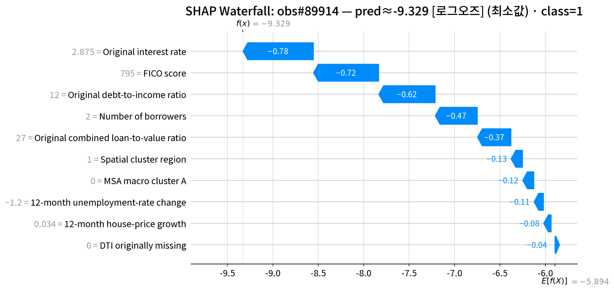

최저 예측 사례(obs#89914)의 log-odds는 **-9.329**로,
baseline **E[f(X)] = -5.894**보다 크게 낮다.

가장 큰 음의 contribution은 Original Interest Rate **-0.78**,
FICO Score **-0.72**, Original DTI **-0.62**,
Number of Borrowers **-0.47**, Original CLTV **-0.37** 순으로 나타났다.

### Median Case

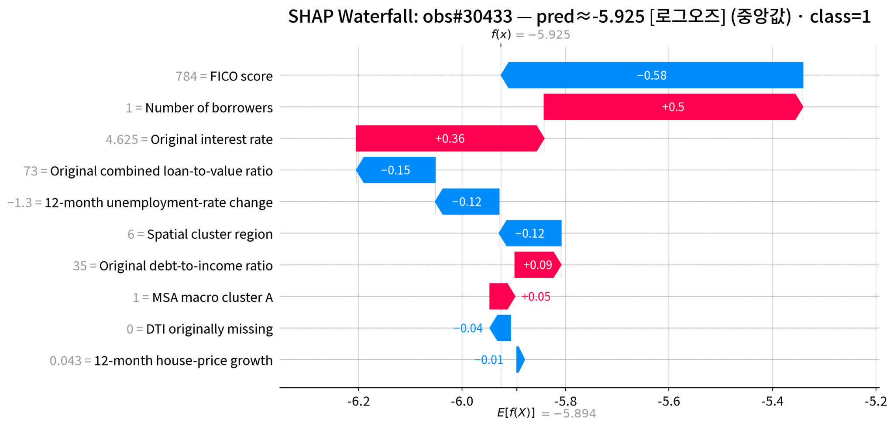

중앙값 사례(obs#30433)의 log-odds는 **-5.925**로,
baseline **-5.894**와 매우 가깝다.

FICO Score **-0.58**, Original CLTV **-0.15**,
12M Unemployment-rate Change **-0.12**, Spatial Cluster Region **-0.12**가
score를 낮추는 반면, Number of Borrowers **+0.50**과
Original Interest Rate **+0.36**이 score를 높여 서로 상쇄되는 구조를 보인다.

### High-score Case

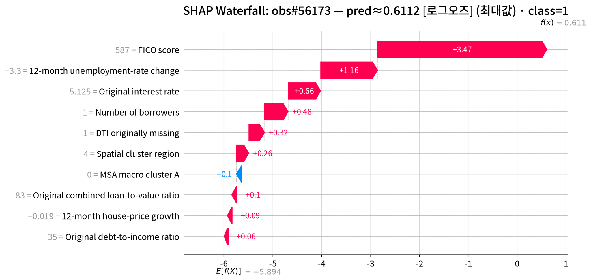

최대 예측 사례(obs#56173)의 log-odds는 **0.611**로,
baseline **-5.894**보다 크게 높다.

가장 큰 양의 contribution은 FICO Score **+3.47**이며,
12M Unemployment-rate Change **+1.16**, Original Interest Rate **+0.66**,
Number of Borrowers **+0.48**, DTI Missing **+0.32**가 추가적으로
score를 증가시켰다.

세 사례는 동일한 feature라도 관측값과 다른 변수의 조합에 따라
contribution의 크기와 방향이 달라질 수 있음을 보여준다.

---

## 14.6 종합 해석

SHAP 분석 결과, 최종 CatBoost 모델은 **FICO Score와 Number of Borrowers를
중심으로 Interest Rate, CLTV, DTI, 지역 정보 및 거시경제 조건을 함께 사용하여
24개월 신용사건 위험을 구분**하고 있다.

특히 FICO, Interest Rate, CLTV 및 Unemployment-rate Change에서는 단순한
선형 관계가 아니라 특정 구간에서 contribution의 크기와 방향이 변화하는
비선형 구조가 관찰되었다. Spatial Cluster 역시 고정적인 지역 위험효과보다는
주택가격 환경 및 다른 대출 특성과 결합된 모델 특성으로 나타났다.

따라서 SHAP 결과는 개별 변수를 독립적인 위험계수로 해석하기보다,
**CatBoost가 borrower characteristics, loan characteristics, spatial information,
macroeconomic conditions의 비선형 관계와 interaction을 어떻게 활용하는지**
설명하는 결과로 해석하는 것이 적절하다.

모든 SHAP 결과는 모델의 예측 행동에 대한 설명이며, 개별 feature가 실제
신용사건을 유발한다는 인과적 증거를 의미하지 않는다.

------------------------------------------------------------------------

# 15. 7F vs 10F: 거시경제 변수 Ablation

Mortgage credit risk에서 borrower/loan 정보와 거시·공간 정보를 함께 고려하는 접근은 관련 선행연구에서도 다루어져 왔다. [[9]](#ref-9) [[10]](#ref-10)

거시경제 정보의 추가적인 예측 기여도를 확인하기 위해 기존 10F 모델에서 다음
3개 macro feature를 제거한 7F 모델을 동일한 조건에서 비교하였다.

- `Housing_HPI_Growth_12M`
- `BLS_Unemployment_Rate_Change_12M_Final`
- `Regular_MSA_Macro_Cluster_A`

따라서 **7F는 borrower/loan 및 spatial information만 사용한 baseline**이며,
**10F는 동일한 7F feature에 macro 3F를 추가한 모델**이다.

---

## 15.1 7F Baseline 및 일반화 상태

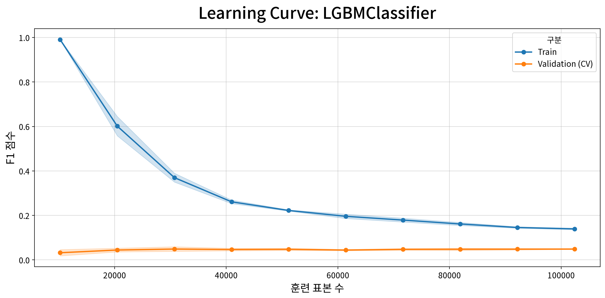

Macro feature를 제거한 7F에서도 상당한 기본 예측력이 유지되었다.

| Metric | Train | CV | Test |
|---|---:|---:|---:|
| F1 | 0.0573 | 0.0505 | 0.0557 |
| PR-AUC | 0.0827 | 0.0291 | 0.0333 |
| ROC-AUC | 0.8360 | 0.8191 | 0.8420 |
| Recall | 0.5048 | 0.4313 | 0.4728 |

특히 ROC-AUC는 Train 0.8360, CV 0.8191, Test 0.8420으로 유지되었으며,
learning curve에서도 표본 수가 증가하면서 Train–CV 차이가 감소하였다.

즉, **7F 자체가 이미 비교적 강한 baseline이며, macro 3F를 제거하더라도
borrower/loan 및 spatial feature만으로 상당한 ranking signal을 확보할 수 있다.**

따라서 이후 10F의 성능 차이는 기본적인 예측 가능 여부가 아니라,
**이 baseline 위에 macro information이 추가적인 위험 구분 능력을 제공하는지**를
확인하는 ablation으로 해석한다.

---

## 15.2 7F vs 10F Out-of-Sample 성능

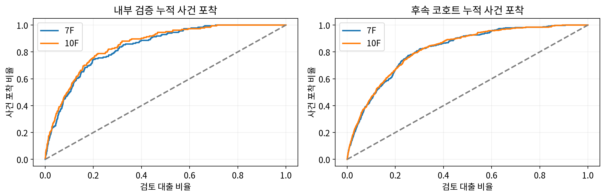

| Cohort | Model | ROC-AUC | PR-AUC | Top-5% Capture | Top-20% Capture |
|---|---|---:|---:|---:|---:|
| Test | 7F | 0.8420 | 0.0333 | 29.89% | 74.46% |
| Test | **10F** | **0.8554** | **0.0477** | **35.87%** | **75.54%** |
| Validation | 7F | 0.8228 | 0.0376 | 27.89% | 66.84% |
| Validation | **10F** | **0.8253** | **0.0415** | **30.00%** | 66.84% |

10F − 7F의 변화량은 다음과 같다.

| Cohort | ΔROC-AUC | ΔPR-AUC | ΔTop-5 Capture | ΔTop-20 Capture |
|---|---:|---:|---:|---:|
| Test | +0.0134 | +0.0144 | **+5.98%p** | +1.09%p |
| Validation | +0.0025 | +0.0039 | **+2.11%p** | 0.00%p |

### Internal Test

Test에서는 macro 3F를 추가한 10F가 주요 ranking metric에서 모두 7F보다 높은
값을 보였다.

특히 **PR-AUC는 0.0333 → 0.0477**, **Top-5% Capture는
29.89% → 35.87%**로 증가하였다. 반면 Top-20% Capture의 증가는
74.46% → 75.54%로 상대적으로 작았다.

이는 macro information의 효과가 전체 위험 순위를 크게 재구성하기보다는,
**가장 높은 위험 점수를 받은 상위 구간에서 실제 사건을 추가적으로 식별하는 데
더 크게 나타났음**을 보여준다.

### Out-of-Time Validation

시간적으로 분리된 Validation에서는 7F와 10F의 차이가 Test보다 작아졌다.

그러나 10F는 여전히

- ROC-AUC: **0.8228 → 0.8253**
- PR-AUC: **0.0376 → 0.0415**
- Top-5% Capture: **27.89% → 30.00%**

의 개선을 유지하였다.

반면 Top-20% Capture는 두 모델 모두 66.84%로 동일하였다.

따라서 macro 3F의 이점은 모든 평가 지표에서 균일하게 나타나는 것이 아니라,
**OOT에서도 특히 PR-AUC와 Top-5% risk ranking에서 남아 있는 제한적이지만
일관된 incremental signal**로 보는 것이 적절하다.

---

## 15.3 Macro Feature의 Incremental Value

두 모델의 비교에서 중요한 점은 **7F의 성능이 낮아서 10F가 우수한 것이 아니라는
점**이다.

7F만으로도 Test ROC-AUC 0.8420, Validation ROC-AUC 0.8228을 확보하므로,
기본적인 신용위험 ranking의 상당 부분은 borrower/loan 및 spatial variables로
설명된다.

그 위에 macro 3F를 추가한 10F는:

> **전체적인 ranking 성능을 소폭 개선하면서, 특히 상위 5% 고위험군에서
> 실제 사건을 더 많이 포착하였다.**

이 효과는 Test에서 가장 명확하고, OOT Validation에서는 크기가 감소하지만
방향 자체는 ROC-AUC, PR-AUC, Top-5% Capture에서 유지된다.

따라서 현재 결과는 **macro variables가 core credit-risk signal을 대체하는
주요 predictor라기보다, 기존 borrower/loan/spatial signal 위에서
high-risk tail의 ranking을 보완하는 incremental information을 제공한다**는
해석과 가장 잘 부합한다.

---

## 15.4 결론 및 한계

Ablation 결과를 종합하면:

**7F**
- Macro information 없이도 강한 baseline ranking 성능을 유지
- Train–CV learning curve에서도 뚜렷한 과적합 붕괴가 관찰되지 않음

**10F**
- Test에서 ROC-AUC, PR-AUC 및 Top-5% Capture 모두 개선
- OOT Validation에서도 ROC-AUC, PR-AUC 및 Top-5% Capture의 개선 방향 유지
- 특히 **high-risk tail에서 추가적인 사건 포착 능력**이 관찰됨
- 다만 Top-20% 수준에서는 OOT incremental gain이 거의 나타나지 않음

따라서 **현재 Regular-PIT benchmark에서는 macro 3F를 포함한 10F가
7F의 기본적인 위험 ranking을 유지하면서, 특히 상위 위험군 식별에서
추가적인 predictive value를 제공하는 것으로 나타났다.**

다만 OOT Validation에서 개선 폭이 감소하며, 현재 비교에는 bootstrap confidence
interval이 포함되지 않았다. 또한 macro feature에는 publication lag와 관련된
Regular-PIT limitation이 존재한다.

따라서 macro feature의 효과를 통계적으로 확정된 개선으로 단정하기보다는,
**현재 실험에서 관찰된 incremental predictive value가 Strict-PIT에서도
재현되는지 추가 검증하는 것이 다음 단계이다.**

------------------------------------------------------------------------

# 16. Risk Segmentation 및 운영 해석

모델의 연속적인 prediction score를 실제 위험관리 관점에서 해석하기 위해,
대출을 예측위험 순위에 따라 4개의 risk band로 구분하였다.

| Risk Band | Population Share | 정의 |
|---|---:|---|
| **Very High** | Top 5% | 가장 높은 예측위험 |
| **High** | Next 15% | 상위 5–20% |
| **Medium** | Next 30% | 상위 20–50% |
| **Low** | Remaining 50% | 하위 50% |

이 구분은 절대적인 부도확률 기준이 아니라, **모델이 부여한 risk score의
상대적 순위**를 이용하여 고위험 대출을 우선적으로 식별하기 위한 것이다.

---

## 16.1 Risk Band의 위험 분리

각 cohort에서 percentile 기준으로 risk band를 구성했을 때 다음과 같은
위험 분리가 관찰되었다.

| Dataset | Risk Band | Event Rate | Lift | Event Capture |
|---|---|---:|---:|---:|
| **Train OOF** | Very High | **3.81%** | **6.64×** | **33.20%** |
| | High | 1.35% | 2.35× | 35.24% |
| | Medium | 0.46% | 0.80× | 24.08% |
| | Low | 0.09% | 0.15× | 7.48% |
| **Internal Test** | Very High | **4.12%** | **7.17×** | **35.87%** |
| | High | 1.52% | 2.65× | 39.67% |
| | Medium | 0.36% | 0.63× | 19.02% |
| | Low | 0.06% | 0.11× | 5.43% |
| **OOT Validation** | Very High | **4.65%** | **6.00×** | **30.00%** |
| | High | 1.90% | 2.46× | 36.84% |
| | Medium | 0.65% | 0.84× | 25.26% |
| | Low | 0.12% | 0.16× | 7.89% |

세 cohort 모두에서 event rate가

**Very High → High → Medium → Low**

순으로 명확하게 감소하였다.

특히 OOT Validation에서도 **Very High 5%가 전체 사건의 30.0%를 포착**하였으며,
상위 20%(Very High + High)까지 확대하면 **66.84%**의 사건을 포착하였다.
이는 시간 외 데이터에서도 모델의 risk ranking이 유지되고 있음을 보여준다.

---

## 16.2 실제 운영에서는 왜 Fixed Cutoff가 필요한가?

위의 percentile 분석은 모델의 ranking capability를 평가하기에는 유용하지만,
실제 운영에서는 한 가지 중요한 문제가 존재한다.

Offline 분석에서는 Test 또는 Validation cohort 전체가 이미 존재하므로,
모든 대출을 score 순으로 정렬하여 사후적으로 Top 5%, Top 20%를 계산할 수 있다.

반면 실제 업무에서는 새로운 대출이 순차적으로 유입되기 때문에,
현재 시점에서 **앞으로 들어올 전체 대출의 score distribution을 알 수 없다.**

따라서 신규 대출 한 건이 들어왔을 때

> “이 대출이 미래 전체 portfolio에서 Top 5%에 해당하는가?”

를 직접 계산할 수 없다.

이를 해결하기 위해 **저장된 최종 10F CatBoost 모델로 model-fitting Train(`X_fit`, N=128,002)을 scoring하여 얻은 Train-fit score distribution의 percentile boundary를 numeric score cutoff로
변환한 뒤 고정(freeze)**하여 미래 데이터에 적용한다.

여기서 fixed cutoff의 reference score는 CV 과정의 OOF prediction이 아니라, 저장된 최종 10F CatBoost 모델로 model-fitting Train(`X_fit`, N=128,002)을 다시 scoring한 **in-sample Train-fit score**이다. 따라서 아래 세 cutoff의 provenance는 `Train OOF`가 아니라 **final-model Train-fit reference distribution**이다.

| Risk Band | Fixed Score 기준 | Final-model Train-fit 기준 |
|---|---:|---:|
| **Very High** | Score ≥ **0.021036** | Train-fit Top 5% |
| **High** | **0.007712 ≤ Score < 0.021036** | Train-fit Next 15% |
| **Medium** | **0.002666 ≤ Score < 0.007712** | Train-fit Next 30% |
| **Low** | Score < **0.002666** | Train-fit Remaining 50% |

여기서 Top 5% / 20% / 50%는 **final-model Train-fit reference distribution에서 cutoff를 설정하기 위한 기준**이며,
새로운 데이터에서 매번 percentile을 다시 계산한다는 의미가 아니다.

예를 들어 새로운 대출의 prediction score가 `0.025`라면,
미래 전체 portfolio의 분포를 아직 알지 못하더라도

**0.025 ≥ 0.021036 → Very High**

로 즉시 분류할 수 있다.

즉, fixed cutoff는 과거 reference population에서 정의한 상대적 위험순위를
**미래의 개별 대출에 즉시 적용할 수 있는 operational rule로 변환하는 역할**을 한다.

---

## 16.3 Frozen Cutoff 적용 결과

final-model Train-fit reference distribution에서 설정한 cutoff를 변경하지 않고 Internal Test에 적용한 결과,
다음과 같은 위험 분리가 나타났다.

| Risk Band | Event Rate | Events / Loans |
|---|---:|---:|
| **Very High** | **4.231%** | 63 / 1,489 |
| **High** | **1.562%** | 75 / 4,801 |
| **Medium** | **0.371%** | 36 / 9,702 |
| **Low** | **0.0625%** | 10 / 16,009 |

Event rate는

**4.231% → 1.562% → 0.371% → 0.0625%**

로 위험등급이 낮아질수록 뚜렷하게 감소하였다.

Very High group의 event rate는 Low group보다 약 **68배** 높았다.
따라서 final-model Train-fit reference distribution에서 설정한 고정된 risk scale 을 새로운 데이터에 적용하더라도
고위험 대출과 저위험 대출을 효과적으로 분리할 수 있음을 확인하였다.

---

## 16.4 Percentile Band와 Fixed Cutoff의 차이

두 방식은 목적이 다르다.

| 방식 | 기준 | 장점 | 주요 용도 |
|---|---|---|---|
| **Percentile Band** | 각 cohort 내부의 상대적 순위 | 항상 일정한 population share 유지 | 모델의 ranking 성능 평가 |
| **Fixed Cutoff** | final-model Train-fit reference distribution에서 고정한 score boundary | 미래 전체 분포 없이 즉시 분류 가능 | 실제 운영 및 신규 대출 분류 |

따라서 fixed cutoff를 적용하면 새로운 데이터에서 Very High group이
항상 정확히 5%가 될 필요는 없다.

새로운 cohort의 borrower composition이나 score distribution이 달라지면
각 risk band에 포함되는 population share 역시 달라질 수 있다.

이는 오류가 아니라, **동일한 reference scale을 미래 데이터에 적용한 결과**이다.

---

## 16.5 운영상 한계: Risk Scale의 재검증과 재설정

현재의 fixed cutoff

**0.021036 / 0.007712 / 0.002666**

는 현재 저장된 최종 10F 모델의 model-fitting Train(`X_fit`, N=128,002) score distribution을 기준으로 설정된
**frozen reference scale**이다.

현재 시스템은 새로운 데이터가 들어올 때 모델이나 cutoff를 자동으로 업데이트하는
online/adaptive system이 아니다.

시간이 지나면서 borrower composition, macroeconomic environment, event rate 또는
model score distribution이 변화하면, 동일한 cutoff가 과거와 동일한 위험수준을
의미하지 않을 수 있다.

따라서 실제 운영에서는 주기적으로 다음 과정을 수행해야 한다.

**신규 데이터 축적  
→ Score distribution 변화 확인  
→ Band별 population share 및 event rate 확인  
→ Capture / Lift 등 위험분리 성능 검증  
→ 필요 시 cutoff recalibration  
→ 모델 성능 자체가 저하될 경우 retraining**

여기서 **cutoff recalibration과 model retraining은 구분할 필요가 있다.**

모델의 ranking capability가 유지되고 있다면 모델 전체를 다시 학습하지 않고
risk cutoff만 새로운 reference population에 맞게 조정할 수 있다.
반대로 ranking 성능 자체가 저하된다면 모델 재학습까지 고려해야 한다.

> **Fixed cutoff는 미래 전체 portfolio의 분포를 미리 알 수 없는 상황에서도
> 신규 대출을 즉시 분류하기 위한 operational risk scale이다. 다만 이 기준은
> 영구적인 절대 위험척도가 아니므로, 새로운 데이터가 축적됨에 따라 위험분리
> 성능과 score distribution을 주기적으로 검증하고 필요할 경우 재설정해야 한다.**

------------------------------------------------------------------------

# 17. OOT Validation Risk-Tier Profile

본 프로젝트는 동일 시점의 random holdout과 시간적으로 이후의 cohort를 구분하여 평가한다. 이러한 out-of-sample / out-of-time 구분은 Freddie Mac 기반 credit-scoring 연구의 robust evaluation 설계와도 연결된다. [[8]](#ref-8)

final-model Train-fit reference distribution에서 설정한 **동일한 frozen score cutoff**를
2017-04~2018-03 OOT Validation cohort에 적용하여,
각 risk tier의 실제 사건율과 borrower profile을 비교하였다.

| Risk Tier | Loans | Actual 24M Event Rate | Median FICO | Median CLTV | Single-Borrower Share | DTI Missing |
|---|---:|---:|---:|---:|---:|---:|
| **Very High** | 2,704 | **4.586%** | **662** | 80 | **86.3%** | **13.9%** |
| **High** | 9,593 | **1.699%** | 701 | 80 | 72.6% | 5.3% |
| **Medium** | 16,776 | **0.459%** | 745 | 80 | 63.7% | 2.6% |
| **Low** | 19,965 | **0.080%** | **780** | 75 | **29.8%** | **1.4%** |

## 17.1 미래 cohort에서도 나타나는 명확한 Risk Gradient

Train에서 고정한 cutoff를 미래 OOT cohort에 그대로 적용했음에도
실제 24개월 event rate는

**4.586% → 1.699% → 0.459% → 0.080%**

로 Very High에서 Low까지 일관되게 감소하였다.

동시에 risk tier가 낮아질수록:

- **Median FICO:** 662 → 701 → 745 → 780
- **Single-Borrower Share:** 86.3% → 72.6% → 63.7% → 29.8%
- **DTI Missing:** 13.9% → 5.3% → 2.6% → 1.4%

의 뚜렷한 변화가 나타났다.

반면 **Median CLTV는 Very High, High, Medium에서 모두 80**으로 동일하고
Low에서도 75로 차이가 상대적으로 작았다.

따라서 risk tier는 특정 단일 변수의 threshold를 그대로 반영하는 것이 아니라,
**FICO, borrower structure, DTI information, CLTV, interest rate, spatial 및
macroeconomic variables를 포함한 10개 feature의 조합으로 형성된
CatBoost risk score의 결과**로 해석하는 것이 적절하다.

> **즉, OOT Validation에서 frozen cutoff가 실제 사건위험을 분리할 뿐 아니라,
> 경제적으로 해석 가능한 borrower-risk profile도 함께 구분하고 있음을 확인하였다.**

------------------------------------------------------------------------

# 18. Leakage 및 Point-in-Time Audit

전체 pipeline에 대해 data leakage와 point-in-time (PIT) consistency를 점검하였다.

최종 audit 결과는:

> **PASS WITH CAVEATS**

로 정리한다.

기본적인 Train–Validation 분리와 feature engineering 과정에서는 명확한
target leakage가 확인되지 않았지만, **temporal validation 구조와 macroeconomic
feature의 publication lag**에는 추가적인 주의가 필요하다.

---

## 18.1 확인된 Leakage Control

다음 항목은 정상적으로 분리되어 있다.

| Audit Item | Result |
|---|---|
| Train / Validation First Payment Date | 기간 분리 |
| Loan_ID | Overlap 없음 |
| `Target_24M` | Feature engineering에 사용되지 않음 |
| DTI median | Train에서만 추정 |
| Spatial K-Means | Train에서만 fit |
| Macro scaler / K-Means | Train에서만 fit |
| Validation processing | Transform / predict only |
| 7F / 10F feature set | 명시적으로 고정 |
| Calibration OOF prediction | Fold-out observation에만 할당 |

따라서 현재 pipeline에서 **Validation 정보를 이용하여 preprocessing 또는
feature learner를 학습하는 직접적인 leakage는 확인되지 않았다.**

---

## 18.2 Caveat 1 — 24개월 Label Window의 Calendar Overlap

Train cohort의 First Payment Date는 2017-03까지이며,
Validation cohort는 2017-04부터 시작한다.

그러나 각 loan의 `Target_24M`은 이후 24개월의 performance를 관찰하여 정의되므로,

**First Payment Date 기준 cohort separation과 label observation period의
완전한 calendar separation은 동일하지 않다.**

즉,

`Train first-payment period ≠ Train target-observation period`

이다.

이는 Validation의 feature 또는 target을 Train feature engineering에 사용한
**직접적인 feature/target leakage를 의미하지는 않는다.**

다만 실제 시점 기준으로 Train label이 모두 확정된 이후에만 Validation이 시작되는
강한 형태의 **temporal embargo validation은 아니므로**, temporal-validation
limitation으로 명시한다.

---

## 18.3 Caveat 2 — Regular-PIT Macro Publication Lag

현재 최종 10F 모델은 다음 Regular-PIT macro features를 사용한다.

- `Housing_HPI_Growth_12M`
- `BLS_Unemployment_Rate_Change_12M_Final`
- `Regular_MSA_Macro_Cluster_A`

Regular-PIT는 First Payment Date 이전의 최근 완성 quarter/month를 사용하도록
구성되어 있다.

그러나 **reference period가 과거라는 사실만으로 해당 통계가 그 시점에 실제로
공개되어 있었다고 보장할 수는 없다.**

공식 통계에는 publication lag가 존재하기 때문이다.

프로젝트의 conservative availability proxy를 이용한 audit에서는:

| Macro Source | `NOT_YET_AVAILABLE` |
|---|---:|
| **FHFA Regular observation** | **약 91.9%** |
| **BLS Regular observation** | **100%** |

가 평가 기준일 당시 아직 이용 가능하지 않았을 가능성이 있는 observation으로
분류되었다.

이 결과를 **91.9% 또는 100%의 target leakage가 발생했다는 의미로 해석해서는
안 된다.**

문제는 미래의 loan-performance label을 사용한 것이 아니라,
**실제 예측 시점에서 아직 발표되지 않았을 가능성이 있는 macro observation을
사용했을 수 있다는 PIT availability 문제**이다.

따라서 현재 Regular-PIT 10F는 유용한 benchmark이지만,

> **production-grade PIT-safe model로 해석하지 않는다.**

---

### 18.4 Regular-PIT와 Strict-PIT의 계산 정의

대출 \(i\)의 기준일은 `First_Payment_Date`로 정의한다.

$$
t_i = \mathrm{First\ Payment\ Date}_i
$$

Regular-PIT와 Strict-PIT의 차이는 단순히 미래 observation의 사용 여부가 아니라,
**reference period의 종료와 실제 정보 이용 가능 시점(publication lag)을
어떻게 처리하는가**에 있다.

---

#### Regular-PIT

Regular-PIT는 `First_Payment_Date` 이전의 가장 최근 완료 period를 사용한다.

FHFA의 경우:

$$
Q_i^{Reg}=Q(t_i)-1
$$

즉, First Payment Date가 속한 quarter의 직전 완료 quarter를 사용한다.

BLS의 경우:

$$
M_i^{Reg}=M(t_i)-1
$$

즉, First Payment Date가 속한 month의 직전 month를 사용한다.

12개월 변화량은 해당 reference period를 기준으로 과거 12개월을 비교한다.

FHFA HPI growth:

$$
G_{HPI,12M}(g,q)
=
\frac{HPI_{g,q}}{HPI_{g,q-4}}-1
$$

BLS unemployment-rate change:

$$
\Delta UR_{12M}(g,m)
=
UR_{g,m}-UR_{g,m-12}
$$

따라서 이 변수들은 미래 12개월의 변화가 아니라,
**reference period까지 이미 관측된 과거 12개월의 변화**를 나타낸다.

다만 Regular-PIT는 reference period가 과거라는 것만 보장하며,
해당 통계가 `First_Payment_Date` 당시 실제로 발표되어 있었는지까지는
확인하지 않는다.

---

#### Strict-PIT / Lag-Safe

Strict-PIT는 Regular-PIT reference period에서 시작한 뒤,
보수적으로 설정한 publication-availability rule을 만족할 때까지
reference period를 과거 방향으로 이동한다.

FHFA quarter \(q\)의 assumed availability date는:

$$
A_{FHFA}(q)
=
EndQuarter(q)+2\text{ months}+1\text{ day}
$$

로 정의한다.

따라서 Strict FHFA reference quarter는:

$$
Q_i^{Strict}
=
\max
\left\{
q \le Q_i^{Reg} :
A_{FHFA}(q)<t_i
\right\}
$$

이다.

BLS month \(m\)의 assumed availability date는:

$$
A_{BLS}(m)
=
EndMonth(m)+45\text{ days}
$$

로 정의한다.

따라서 Strict BLS reference month는:

$$
M_i^{Strict}
=
\max
\left\{
m \le M_i^{Reg} :
A_{BLS}(m)<t_i
\right\}
$$

이다.

즉, Strict-PIT는 Regular-PIT에서 **고정적으로 특정 quarter/month 수를
차감하는 방식이 아니다.**

각 observation의 assumed availability date가 `First_Payment_Date`보다
엄격히 이전이 될 때까지 quarter 또는 month를 한 단계씩 뒤로 이동한다.

```text
Regular-PIT
    ↓
최근 완료된 quarter / month 선택
    ↓
Assumed availability date < First Payment Date ?
    │
    ├── Yes → Strict-PIT reference period로 사용
    │
    └── No  → 1 quarter / 1 month 뒤로 이동 후 재검사
```

Strict reference period가 결정된 후에는 해당 시점의 source data를 다시 조회하여

- `LS_Housing_HPI_Growth_12M`
- `LS_BLS_Unemployment_Rate_Change_12M_Final`

등의 Lag-Safe feature를 재구성한다.

FHFA housing feature는 Regular와 Strict 모두
**MSA/MSAD → ZIP3 → State**의 geography hierarchy를 사용한다.

BLS의 경우 local MSA/MSAD 값이 없는 observation에는 State fallback을 적용하며,
Strict State fallback은 별도로 구축된
`Strict_PIT_BLS_State_Month_Date`를 사용하여 동일한 publication-aware 원칙을 유지한다.

---

#### 해석상의 주의

Strict-PIT의 availability date는 실제 historical release timestamp가 아니라
프로젝트에서 설정한 **conservative publication-lag proxy**이다.

따라서 Strict-PIT / Lag-Safe는 Regular-PIT보다 real-time information
availability를 훨씬 엄격하게 통제하지만, historical vintage까지 완전히
재현한 perfect real-time dataset을 의미하지는 않는다.

---

## 18.5 현재 결과의 해석 범위

따라서 본 프로젝트의 현재 결론은 다음과 같다.

> **현재 pipeline에서는 명확한 target leakage 또는 Train–Validation
> preprocessing leakage가 확인되지 않았다. 그러나 최종 10F의 Regular-PIT
> macro variables는 실제 publication lag를 완전히 반영하지 않으므로,
> 현재 성능은 Regular-PIT benchmark로 해석해야 한다.**

특히 #15에서 관찰된 **10F의 7F 대비 incremental performance**가
실제 deployment 시점에서도 유지되는지를 확인하려면,

**Strict-PIT 10F 재학습 → OOT Validation → 7F vs Strict-10F ablation**

이 추가적으로 필요하다.

따라서 현재 단계에서 가장 중요한 미완료 검증은
**macro information을 실제 이용 가능 시점으로 제한한 후에도 10F의 추가적인
predictive value가 유지되는지 확인하는 것**이다.

------------------------------------------------------------------------

# 19. 프로젝트의 한계

본 프로젝트는 24개월 신용사건의 **relative risk ranking과 risk-tier separation**을
목적으로 하는 modeling framework를 구축하였다. 그러나 현재 결과를 실제
production 환경의 실시간 신용위험 시스템으로 확장하기 위해서는 다음과 같은
제한사항을 고려해야 한다.

---

## 19.1 Point-in-Time 및 Temporal Alignment

현재 최종 10F CatBoost는 **Regular-PIT macro feature**를 사용하며,
Strict-PIT / Lag-Safe feature로 재학습한 최종 모델은 아니다.

또한 macro alignment의 기준일은 실제 application 또는 underwriting decision
date가 아니라 `First_Payment_Date`이다.

Strict-PIT에서는 conservative publication-lag rule을 적용하여 정보 이용 가능성을
보다 엄격하게 통제하지만, 현재 FHFA/BLS historical data가 각 시점의 최초 발표
vintage와 완전히 동일한지까지 보장하지는 않는다.

따라서 현재 10F는 macro feature의 predictive contribution을 평가하는
**Regular-PIT benchmark**로 해석하며, 향후에는 Strict-PIT 10F 재학습과
historical-vintage audit가 필요하다.

---

## 19.2 Geography 및 Macro Mapping의 불확실성

Historical MSA/CBSA 정의 변경으로 인해 과거 Freddie Mac geography와 macro data를
완벽하게 연결하는 데 한계가 있다.

본 프로젝트에서는 historical crosswalk와 geography fallback을 사용하였으며,
필요한 경우 MSA 수준에서 해결되지 않은 observation을 ZIP3 또는 State 수준으로
보완하였다.

이는 coverage를 높이는 대신 observation별 geographic granularity가 달라지는
trade-off를 발생시킨다.

또한 `Spatial_Cluster_Region`은 실제 property coordinate가 아니라
**ZIP3 대표 좌표를 기반으로 Train에서 생성한 coarse geographic regime**이며,
`Regular_MSA_Macro_Cluster_A`의 일부 observation 역시 fallback mapping을 통해
할당된다.

따라서 이러한 geographic feature를 특정 지역 자체의 인과적 신용위험으로
해석해서는 안 된다.

---

## 19.3 DTI Missingness와 Median Imputation

`Original_DTI`의 결측치는 Train에서 계산한 **median = 35**로 대체하고,
원래 결측이었던 observation에는 별도의 `DTI_Missing = 1` indicator를 부여하였다.

따라서 모델은 다음 두 경우를 구분할 수 있다.

| Original_DTI | DTI_Missing | 의미 |
|---:|---:|---|
| 35 | 0 | 실제 관측된 DTI = 35 |
| 35 | 1 | DTI 결측 → median 35로 대체 |

실제 분석에서도 DTI가 원래 35였던 집단과 DTI-missing 집단의 사건위험에는
차이가 있었으며, **DTI-missing 집단에서 더 높은 위험이 관찰되었다.**

따라서 `DTI_Missing`을 별도 feature로 유지함으로써 missingness 자체의 정보를
일부 보존하였다.

그러나 median imputation은 결측 대출의 실제 DTI 값을 복원하는 방법은 아니다.
이에 따라 DTI dependence plot에서 두 집단이 동일한 `DTI = 35` 위치에 나타날 수
있으며, `Original_DTI`와 `DTI_Missing`의 SHAP contribution도 함께 해석해야 한다.

향후에는 Train 내부에서만 규칙을 결정한다는 원칙을 유지하면서
missing-aware treatment, model-based imputation 또는 alternative DTI proxy와의
sensitivity analysis가 필요하다.

특히 DTI-missing 집단과 유사한 event rate를 갖는 observed DTI 영역을
alternative proxy 후보로 검토할 수 있으나, **Validation/OOT target을 이용하여
imputation 값을 결정해서는 안 된다.**

---

## 19.4 Validation과 Model-Selection Bias

2017-04~2018-03 Validation cohort의 label을 모델 fitting이나 preprocessing
statistics 추정에 직접 사용하지는 않았다.

그러나 개발 과정에서 해당 cohort의 결과를 여러 feature 및 model comparison에서
반복적으로 관찰하였다.

따라서 이 cohort는 엄밀한 의미의 untouched final holdout보다는

> **chronological model-comparison / validation cohort**

로 표현하는 것이 적절하다.

향후에는 model specification과 preprocessing을 완전히 freeze한 후 별도의
untouched OOT cohort에서 최종 성능을 평가해야 한다.

---

## 19.5 7F vs 10F 개선폭의 불확실성

OOT Validation에서 10F는 7F보다 다음과 같이 높은 point estimate를 보였다.

| Metric | 10F − 7F |
|---|---:|
| ROC-AUC | +0.002542 |
| PR-AUC | +0.003898 |
| Top-5% Capture | +2.1053%p |
| Top-20% Capture | 0.0000%p |

따라서 macro feature를 포함한 10F가 여러 주요 ranking metric에서 긍정적인
방향을 보였다는 것은 확인할 수 있다.

그러나 일부 개선폭은 작고 bootstrap confidence interval 또는 paired uncertainty
analysis가 아직 수행되지 않았다.

따라서 현재 결과만으로 macro feature가 **통계적으로 확정된 incremental
predictive value**를 제공한다고 단정하지 않는다.

---

## 19.6 Risk Tier와 Probability 해석의 한계

현재 risk-tier cutoff는 Train score distribution을 기준으로 설정한
**고정된 segmentation benchmark**이다.

Very High = Top 5%라는 기준은 review capacity, false-positive cost,
missed-event cost 또는 intervention cost를 고려하여 최적화한 operational
threshold가 아니다.

또한 tier별 event rate는 **group-level empirical risk**이며 개별 대출의
Probability of Default(PD)를 의미하지 않는다.

Chronological Validation의 고위험 영역에서는 실제 사건율이 평균 calibrated
probability보다 높은 현상도 관찰되었다.

예를 들어:

| Validation Segment | Actual Event Rate | Mean Calibrated Probability |
|---|---:|---:|
| Very High | 4.6493% | 3.5566% |
| Highest-risk score decile | 3.5889% | 2.7164% |

따라서 현재 모델에서 가장 강하게 검증된 기능은

> **relative risk ranking 및 risk-tier separation**

이며, 정확한 individual-level absolute PD estimation에는 추가적인 OOT calibration
검증이 필요하다.

---

## 19.7 새로운 경제환경에 대한 외삽

현재 chronological validation은 **2017-04~2018-03** 기간을 대상으로 한다.

따라서 이 결과만으로 경기침체, 급격한 금리 변화, 주택가격 하락 또는 팬데믹과
같은 새로운 macroeconomic regime에서도 동일한 성능이 유지된다고 볼 수 없다.

프로젝트에는 **2022-01~2023-12 OOT candidate period**가 별도로 존재하지만,
현재 README의 최종 10F 결과에 대한 untouched final test로 사용하지 않았다.

향후 model specification을 freeze한 후 새로운 economic regime을 포함하는
별도의 OOT evaluation이 필요하다.

---

## 19.8 현재 Risk Scale은 시간이 지나도 자동으로 갱신되지 않는다

현재 risk tier는 새로운 cohort 전체의 percentile을 다시 계산하여 분류하는
방식이 아니라, **Train score distribution에서 설정한 cutoff를 신규 대출에
고정 적용하는 방식**이다.

이 방식은 신규 대출이 한 건씩 들어오는 상황에서도 과거와 동일한 위험 척도로
분류할 수 있다는 장점이 있다.

그러나 미래 population의 risk distribution을 사전에 알 수 없기 때문에,
새로운 데이터가 들어올 때마다 미래 전체 cohort의 Top 5% 또는 Top 20%를
실시간으로 다시 정의할 수는 없다.

따라서 현재의 frozen cutoff는 과거 Train population을 기준으로 설정한
**reference risk scale**이다.

시간이 지나 borrower population 또는 경제환경이 변하면 동일 cutoff가
분리하는 실제 위험수준과 tier population share도 변할 수 있다.

즉, cutoff는 영구적인 기준이 아니라 **주기적인 validation과 필요 시
recalibration이 필요한 운영 기준**이다.

---

## 19.9 Dynamic Real-Time Monitoring System이 아니다

현재 시스템은 신규 대출의 feature를 입력하면 저장된 CatBoost 모델을 통해

`신규 대출 → 고정 preprocessing → CatBoost score → frozen cutoff → risk tier`

의 순서로 평가할 수 있는 **static scoring pipeline**이다.

그러나 새로운 데이터가 유입될 때 모델이 스스로 재학습하거나 cutoff를 자동으로
변경하는 adaptive monitoring system은 아니다.

따라서 실제 deployment에서는 일정 주기로 다음을 모니터링해야 한다. Population drift와 model stability를 정기적으로 점검하는 필요성은 credit-risk model monitoring 문헌과도 연결된다. [[19]](#ref-19)

- feature 및 score distribution drift
- risk-tier population share
- tier별 observed event rate
- ROC-AUC / PR-AUC / Capture / Lift
- probability calibration
- macroeconomic regime 및 data-definition 변화

유의한 drift 또는 performance deterioration이 확인되면 모델 재학습,
calibration 재추정 및 **risk cutoff 재설정**을 수행해야 한다.

따라서 현재 프로젝트는 완전한 dynamic real-time monitoring system보다는

> **고정된 모델과 과거 기준 risk scale을 이용하여 신규 대출을 일관되게
> 평가하는 static risk-scoring framework**

로 정의하는 것이 정확하다.

향후 production system으로 확장하려면 별도의 automated data pipeline,
drift monitoring, scheduled validation, retraining 및 cutoff recalibration
process가 필요하다.

------------------------------------------------------------------------

# 20. 현재 결론

본 프로젝트는 Freddie Mac 대출 데이터를 이용하여 **24개월 신용사건의 상대적
위험을 사전에 순위화하고, 이를 일관된 risk tier로 구분하는 framework**를 구축하였다.

## 20.1 24개월 신용위험 Ranking

최종 Regular-PIT 10F CatBoost는 다음의 ROC-AUC를 기록하였다.

| Cohort | ROC-AUC | PR-AUC | Top-5% Capture |
|---|---:|---:|---:|
| Internal Test | **0.8554** | **0.0477** | **35.87%** |
| Chronological Validation | **0.8253** | **0.0415** | **30.00%** |

특히 Chronological Validation에서 **score 상위 5%의 대출이 전체 24개월
신용사건의 30%를 포함**하였다.

따라서 모델은 희소한 신용사건을 전체 portfolio에서 동일하게 취급하는 대신,
상대적으로 위험도가 높은 대출을 우선적으로 식별하는 ranking signal을 유지하였다.

---

## 20.2 고정된 Risk Scale의 시간 외 분리력

앞선 #13의 cohort-specific percentile risk band와 달리, 여기서는
**final-model Train-fit reference distribution에서 사전에 고정한 절대 score cutoff**를
Chronological Validation에 그대로 적용한 결과를 요약한다.

| Risk Tier | Actual 24M Event Rate |
|---|---:|
| **Very High** | **4.586%** |
| **High** | **1.699%** |
| **Medium** | **0.459%** |
| **Low** | **0.080%** |

즉,

**Very High → High → Medium → Low**

순으로 실제 사건율이 명확하게 감소하였다.

이는 새로운 cohort의 전체 score distribution을 다시 이용하여 percentile을
재계산하지 않고도, **과거 Train에서 정의한 고정 risk scale이 이후 기간에서
위험수준을 구분할 수 있었음**을 보여준다.

---

## 20.3 모델이 사용하는 Risk Signal

SHAP 분석에서 FICO는 중요한 risk signal이었지만, 최종 prediction은 하나의
변수만으로 결정되지 않았다.

모델은 FICO, DTI, CLTV, interest rate, number of borrowers와 같은
borrower/loan characteristics뿐 아니라 spatial region, unemployment change,
housing-price growth 및 macro cluster 등의 정보를 함께 사용하였다.

또한 `DTI_Missing`을 별도 feature로 유지하여 DTI 값 자체와 missingness에서
발생하는 정보를 구분하였다.

따라서 최종 risk score는 **borrower, loan, geography 및 macroeconomic
information의 비선형적인 조합**으로 해석하는 것이 적절하다.

---

## 20.4 Macro Feature의 Incremental Value

Regular-PIT benchmark에서 macro feature를 포함한 10F는 macro feature를 제외한
7F보다 Chronological Validation의 여러 ranking metric에서 높은 point estimate를
보였다.

| Metric | 7F | 10F | Difference |
|---|---:|---:|---:|
| ROC-AUC | 0.8228 | **0.8253** | +0.0025 |
| PR-AUC | 0.0376 | **0.0415** | +0.0039 |
| Top-5% Capture | 27.89% | **30.00%** | +2.11%p |
| Top-20% Capture | 66.84% | 66.84% | 0.00%p |

따라서 현재 실험에서는 **macro feature를 추가한 10F가 일부 주요 ranking
metric에서 추가적인 predictive signal을 제공할 가능성**을 확인하였다.

다만 개선폭의 uncertainty estimate가 아직 없으며, 현재 최종 10F는
Strict-PIT / Lag-Safe specification으로 재학습한 모델이 아니다.

따라서 macro feature의 incremental value와 production-level PIT safety를
확정하기 위해서는 **Strict-PIT 10F 재학습 및 paired uncertainty validation**이
추가로 필요하다.

---

## 20.5 최종 정리

현재 결과에서 가장 강하게 확인된 것은 다음 두 가지이다.

> **1. 24개월 신용사건에 대한 상대적 risk ranking**

> **2. Train에서 고정한 risk cutoff를 이용한 시간 외 risk-tier separation**

따라서 본 프로젝트의 현재 결과는 개별 대출의 정확한 absolute PD를 추정하는
완성된 production model이라기보다, **신규 대출을 일관된 risk scale에서
score하고 고위험 대출을 우선적으로 식별하는 risk-ranking framework**로
해석하는 것이 적절하다.

현재 시스템은 자동 재학습되는 dynamic real-time monitoring system이 아니라
**frozen model + frozen risk cutoff 기반의 static scoring framework**이다.
실제 운영 환경으로 확장하기 위해서는 향후 Strict-PIT 검증, untouched OOT
evaluation, calibration monitoring, data/model drift monitoring, scheduled
retraining 및 risk-cutoff recalibration이 필요하다.

------------------------------------------------------------------------

# 21. 향후 작업

현재 결과를 바탕으로 다음 작업을 우선적으로 수행할 수 있다.

1. **Strict-PIT 10F 재학습 및 7F 비교**
   - Regular-PIT macro를 Strict-PIT / Lag-Safe 변수로 교체한다.
   - 동일한 조건에서 7F와 10F를 다시 비교하여 macro feature의 추가적인 예측 신호가 유지되는지 확인한다.

2. **성능 차이의 불확실성 검증**
   - Paired bootstrap을 이용하여 ROC-AUC, PR-AUC, Top-5% 및 Top-20% Capture의 10F−7F 차이에 대한 confidence interval을 계산한다.

3. **Untouched OOT 평가**
   - 모델과 preprocessing을 완전히 고정한 후, 별도로 보존한 **2022-01~2023-12 OOT candidate cohort**에서 최종 성능을 평가한다.

4. **Calibration 및 DTI Missing 처리 개선**
   - 고위험 구간의 probability calibration을 추가 검증한다.
   - 현재의 `DTI median = 35 + DTI_Missing` 방식을 alternative missing-value treatment와 비교한다.

5. **운영 기준 및 모델 유지관리**
   - 현재 percentile 기반 risk cutoff를 실제 review capacity와 비용을 고려한 기준으로 확장한다.
   - 실제 적용 시 feature/score drift와 risk-tier 성능을 주기적으로 확인하고, 필요하면 모델과 risk cutoff를 재설정한다.

> **향후 핵심 방향:**  
> **Strict-PIT 검증 → 불확실성 평가 → Untouched OOT 검증 → 운영 및 주기적 재검증**

------------------------------------------------------------------------

# 22. 참고 자료 및 문헌

본 프로젝트는 Freddie Mac Single-Family Loan-Level Dataset을 기반으로 하며,
주택가격, 노동시장, 공간정보를 결합하기 위해 FHFA, BLS 및 U.S. Census Bureau의
공식 자료를 사용하였다. 또한 mortgage credit-risk modeling, out-of-time validation,
class imbalance, probability calibration, model interpretation 및 model monitoring과
관련된 선행연구를 참고하였다.

---

## 22.1 데이터 및 공식 자료

<a id="ref-1"></a>

[1] **Freddie Mac, Single-Family Loan-Level Dataset (SFLLD).**  
본 프로젝트의 mortgage origination 및 monthly loan-performance data의 기본 자료원.  
https://www.freddiemac.com/research/datasets/sf-loanlevel-dataset

<a id="ref-2"></a>

[2] **Federal Housing Finance Agency (FHFA), House Price Index (HPI).**  
지역별 주택가격 수준 및 `Housing_HPI_Growth_12M`과 같은 housing-market feature
구성에 사용.  
https://www.fhfa.gov/data/hpi

<a id="ref-3"></a>

[3] **U.S. Bureau of Labor Statistics (BLS), Local Area Unemployment Statistics (LAUS).**  
지역별 unemployment rate 및 노동시장 변화 feature 구성에 사용.  
https://www.bls.gov/lau/

<a id="ref-4"></a>

[4] **U.S. Census Bureau, Metropolitan and Micropolitan Statistical Area Delineation Files.**  
MSA/CBSA geographic definition 및 geography reconciliation의 공식 기준 자료.  
https://www.census.gov/geographies/reference-files/time-series/demo/metro-micro/delineation-files.html

<a id="ref-5"></a>

[5] **U.S. Census Bureau, Historical Metropolitan and Micropolitan Statistical Area Delineation Files.**  
과거 MSA/CBSA 정의 변경을 확인하고 historical geography reconciliation을 수행하는 데 사용.  
https://www.census.gov/geographies/reference-files/time-series/demo/metro-micro/historical-delineation-files.html

<a id="ref-6"></a>

[6] **U.S. Census Bureau, 2022 Cartographic Boundary Files — States, 1:500,000.**  
본 프로젝트에서 사용한 state boundary shapefile: `cb_2022_us_state_500k.zip`.  
https://www2.census.gov/geo/tiger/GENZ2022/shp/

<a id="ref-7"></a>

[7] **U.S. Census Bureau, 2020 Census Gazetteer Files — ZIP Code Tabulation Areas (ZCTA).**  
ZIP/ZCTA representative latitude 및 longitude를 이용한 spatial feature 구축에 사용.
본 프로젝트에서는 `2020_Gaz_zcta_national.zip` 내
`2020_Gaz_zcta_national.txt`를 사용하였다.  
https://www2.census.gov/geo/docs/maps-data/data/gazetteer/2020_Gazetteer/

---

## 22.2 Freddie Mac 및 Mortgage Credit-Risk 관련 연구

<a id="ref-8"></a>

[8] **Mushava, J., & Murray, M. (2024).**
*Comprehensive credit scoring datasets for robust testing: Out-of-sample,
out-of-time, and out-of-universe evaluation.*  
Data in Brief, 54, 110262.  
Freddie Mac SFLLD를 이용하여 train, out-of-sample, out-of-time 및
out-of-universe evaluation dataset을 구성한 연구로, 본 프로젝트의 chronological
validation 및 OOT evaluation 설계와 직접적으로 관련된다.  
https://doi.org/10.1016/j.dib.2024.110262

<a id="ref-9"></a>

[9] **Sirignano, J., Sadhwani, A., & Giesecke, K. (2016).**
*Deep Learning for Mortgage Risk.*  
대규모 미국 mortgage origination/performance data와 borrower, loan 및
macroeconomic variables를 결합하여 mortgage risk의 비선형 구조를 분석한 연구이다.
본 프로젝트에서 borrower/loan-level 변수와 지역·거시경제 변수를 함께 고려하는
모델링 방향의 주요 참고문헌이다.  
https://arxiv.org/abs/1607.02470

<a id="ref-10"></a>

[10] **Kündig, P., & Sigrist, F. (2026).**
*A Spatio-Temporal Machine Learning Model for Mortgage Credit Risk:
Default Probabilities and Loan Portfolios.*  
European Journal of Operational Research, 331(3), 1022–1041.  
Tree boosting과 latent spatio-temporal Gaussian process를 결합하여 mortgage
default risk의 비선형성, interaction 및 공간·시간적 heterogeneity를 모델링한 연구이다.
본 프로젝트의 spatial cluster, macroeconomic environment 및 nonlinear risk
modeling과 관련된다.  
https://doi.org/10.1016/j.ejor.2025.10.039

<a id="ref-11"></a>

[11] **Zandi, S., Korangi, K., Óskarsdóttir, M., Mues, C., & Bravo, C. (2025).**
*Attention-based dynamic multilayer graph neural networks for loan default prediction.*  
European Journal of Operational Research, 321(2), 586–599.  
Freddie Mac mortgage data를 이용하여 geography 및 mortgage-provider 관계를
dynamic multilayer network로 구성하고 GNN/RNN 기반 default prediction을 수행하였다.
본 프로젝트의 geographic risk representation 및 향후 dynamic modeling 확장과 관련된다.  
https://doi.org/10.1016/j.ejor.2024.09.025

<a id="ref-12"></a>

[12] **Yang, Y., Lin, Y., Zhang, Y., Su, Z., Goh, C. C., Fang, T., Bellotti, A.,
& Lee, B. G. (2026).**
*Transforming Credit Risk Analysis: A Time-Series-Driven ResE-BiLSTM Framework
for Post-Loan Default Detection.*  
Information, 17(1), 5.  
Freddie Mac SFLLD의 repayment time series를 이용하여 post-loan default를
예측하고, 여러 temporal models와 비교 및 SHAP 분석을 수행하였다.
본 프로젝트의 static origination-based risk scoring과 대비되는 향후
dynamic post-loan monitoring 방향의 참고문헌이다.  
https://doi.org/10.3390/info17010005

<a id="ref-13"></a>

[13] **Hade, A., & Elhia, M. (2025).**
*Predicting mortgage credit defaults in Morocco using machine learning approaches.*  
Discover Artificial Intelligence, 5, 113.  
Logistic regression부터 ensemble machine-learning models까지 다양한 방법을
비교하고 precision, recall, F1 및 ROC-AUC 등을 이용하여 mortgage default
prediction을 평가한 연구이다.  
https://doi.org/10.1007/s44163-025-00303-y

---

## 22.3 Machine Learning 및 CatBoost

<a id="ref-14"></a>

[14] **Prokhorenkova, L., Gusev, G., Vorobev, A., Dorogush, A. V., & Gulin, A. (2018).**
*CatBoost: Unbiased Boosting with Categorical Features.*  
Advances in Neural Information Processing Systems (NeurIPS), 31.  
CatBoost의 ordered boosting 및 categorical-feature 처리 방법의 방법론적 근거로,
본 프로젝트에서 최종 classifier로 CatBoost를 사용하는 주요 참고문헌이다.  
https://proceedings.neurips.cc/paper/2018/hash/14491b756b3a51daac41c24863285549-Abstract.html

---

## 22.4 불균형 데이터와 평가 지표

<a id="ref-15"></a>

[15] **Saito, T., & Rehmsmeier, M. (2015).**
*The Precision-Recall Plot Is More Informative than the ROC Plot When Evaluating
Binary Classifiers on Imbalanced Datasets.*  
PLOS ONE, 10(3), e0118432.  
희소 positive event를 포함하는 불균형 classification에서 ROC뿐 아니라
Precision-Recall 기반 평가가 중요한 이유를 제시한다. 본 프로젝트에서
ROC-AUC와 함께 PR-AUC를 주요 지표로 사용하는 근거와 관련된다.  
https://doi.org/10.1371/journal.pone.0118432

---

## 22.5 Probability Calibration

<a id="ref-16"></a>

[16] **Tasche, D. (2012).**
*The Art of Probability-of-Default Curve Calibration.*  
PD calibration과 risk ranking을 구분하고, rating/risk score를 실제
probability-of-default scale로 변환하는 문제를 다룬다. 본 프로젝트에서
risk ranking 성능과 absolute probability calibration을 별도로 해석하는
방법론적 근거로 참고하였다.  
https://arxiv.org/abs/1212.3716

<a id="ref-17"></a>

[17] **Niculescu-Mizil, A., & Caruana, R. (2005).**
*Predicting Good Probabilities with Supervised Learning.*  
Proceedings of the 22nd International Conference on Machine Learning (ICML),
625–632.  
여러 supervised-learning classifier의 probability distortion을 분석하고
Platt scaling 및 isotonic regression과 같은 calibration 방법을 비교한 연구이다.
본 프로젝트의 calibrated probability 분석과 관련된다.  
https://doi.org/10.1145/1102351.1102430

---

## 22.6 SHAP 및 모델 해석

<a id="ref-18"></a>

[18] **Lundberg, S. M., & Lee, S.-I. (2017).**
*A Unified Approach to Interpreting Model Predictions.*  
Advances in Neural Information Processing Systems (NeurIPS), 30.  
SHAP (SHapley Additive exPlanations)의 이론적 기반으로, 본 프로젝트의
global SHAP importance, beeswarm, dependence plot 및 individual waterfall
분석의 주요 방법론적 참고문헌이다.  
https://proceedings.neurips.cc/paper/7062-a-unified-approach-to-interpreting-model-predictions

---

## 22.7 Model Stability 및 향후 Monitoring

<a id="ref-19"></a>

[19] **Potgieter, C. J., Van Zyl, C., Schutte, W. D., & Lombard, F. (2026).**
*The Population Resemblance Statistic: A Chi-Square Measure of Fit for Banking.*  
Annals of Operations Research, 361, 413–435.  
Credit-risk model monitoring에서 널리 사용되는 Population Stability Index (PSI)의
한계를 논의하고 sample size와 risk category 수를 고려하는 Population Resemblance
Statistic (PRS)을 제안한다. 본 프로젝트를 향후 static scoring framework에서
정기적인 population/model-drift monitoring 체계로 확장할 때 참고할 수 있다.  
https://doi.org/10.1007/s10479-025-07024-6

---

## 22.8 본 프로젝트와 문헌의 연결

본 프로젝트의 주요 설계 선택은 위 문헌과 다음과 같이 연결된다.

- **Freddie Mac SFLLD 및 OOT 설계:** [1], [8]
- **Borrower/loan-level mortgage risk modeling:** [9], [13]
- **Spatial 및 macroeconomic risk information:** [2]–[7], [9]–[11]
- **CatBoost 및 nonlinear modeling:** [10], [14]
- **희소 사건 및 PR-AUC 평가:** [15]
- **Risk ranking과 probability calibration의 구분:** [16], [17]
- **SHAP 기반 global/local interpretation:** [18]
- **Dynamic post-loan monitoring의 향후 확장:** [11], [12]
- **Population drift 및 정기적 model monitoring:** [19]

특히 본 프로젝트는 [8]과 같이 **out-of-sample과 out-of-time evaluation을
구분**하고, [15]를 고려하여 심한 class imbalance 환경에서 ROC-AUC뿐 아니라
PR-AUC와 Top-K Capture/Lift를 함께 평가하였다. 또한 [16], [17]의 관점에 따라
**상대적 risk ranking과 absolute probability calibration을 서로 다른 문제로
구분**하였다.

현재 모델은 origination 시점의 borrower, loan, geography 및 macroeconomic
information을 이용하는 **static risk-scoring framework**이다. 따라서 향후에는
[11], [12]와 같은 temporal/dynamic information을 이용한 post-loan monitoring,
그리고 [19]와 같은 population-drift monitoring을 결합하는 방향으로 확장할 수 있다.

------------------------------------------------------------------------


## Repository에서 함께 제시할 핵심 그림

본 Repository의 `assets/`에는 데이터 특성, 모델 성능, 위험 순위화, 모델 해석 및
검증 결과를 설명하기 위한 주요 시각화가 포함되어 있다.

### 핵심 결과 그림

| Figure | 역할 |
|---|---|
| `target_24m_distribution_train.png` | `Target_24M`의 심한 class imbalance와 희소 사건 구조 확인 |
| `learning_curve_catboost.png` | Train–CV 성능 변화와 모델의 일반화 상태 진단 |
| `cumulative_gains_catboost.png` | 고위험 score 구간에서 실제 사건이 얼마나 집중적으로 포착되는지 평가 |
| `risk_band_event_rates.png` | Very High → High → Medium → Low 위험등급별 실제 사건율 분리 확인 |
| `shap_bar.png` | 전체 모델에서 각 feature의 상대적 SHAP importance 비교 |
| `shap_beeswarm.png` | Feature value와 위험 contribution의 방향 및 분포 확인 |
| `macro_ablation_7F_vs_10F.png` | Macro 3F 추가 전후의 7F–10F 성능 비교 |
| `validation_calibration_diagnostics.png` | Chronological Validation에서 실제 사건율과 calibrated probability 비교 |

### 모델 해석 그림

SHAP dependence plot은 주요 feature의 비선형 효과와 interaction을 확인하는 데
사용하며, representative waterfall plot은 개별 대출에서 각 feature가 모델
prediction에 어떻게 기여했는지를 설명한다.

이러한 추가 그림은 `assets/`에 함께 보관하며, README 본문의 SHAP 분석에서
필요한 결과만 선택적으로 사용한다.

### 핵심 시각화의 역할

전체 시각화는 다음 분석 흐름에 대응한다.

**Class Imbalance → Generalization → Risk Ranking → Risk Segmentation →  
Model Interpretation → Macro Ablation → Probability Calibration**

따라서 각 그림은 독립적인 결과라기보다, 최종 10F CatBoost 모델의
**성능, 일반화, 위험 분리 능력, 해석 가능성 및 현재 한계**를 순차적으로
검증하는 역할을 한다.

------------------------------------------------------------------------

## 적용 범위

본 프로젝트의 최종 모델은 대출 실행 시점에 구성된 **차주·대출·지역·거시경제 정보**를 이용하여 향후 24개월 내 중대한 신용사건의 상대적 위험을 **점수화(scoring), 순위화(ranking), 등급화(segmentation)**하기 위한 신용위험 분석 모델이다.

위험등급은 미래 데이터 전체의 score distribution을 미리 알 수 없는 실제 적용 환경을 고려하여, **Train score distribution에서 사전에 고정한 cutoff**를 사용한다. 따라서 신규 대출이 개별적으로 유입되더라도 동일한 기준으로 **Very High / High / Medium / Low** 위험등급을 부여할 수 있다.

Internal held-out Test와 Chronological Validation을 통해 모델의 **risk ranking 및 risk-tier separation** 능력을 확인하였다. 따라서 현재 모델은 **신규 대출의 상대적 위험 평가, 고위험 대출 식별 및 risk-based screening의 우선순위 설정**에 활용할 수 있다.

다만 현재 결과를 개별 대출의 정확한 **absolute PD**로 해석해서는 안 되며, 현재 시스템은 데이터 변화에 따라 자동으로 학습·갱신되는 **dynamic real-time monitoring system**도 아니다.

또한 최종 10F 모델은 현재 **Regular-PIT macro benchmark**를 사용한다. 실제 운영 적용을 위해서는 향후 **Strict/LS macro 기반 재학습, untouched OOT 검증, calibration 재검증**, 그리고 데이터 환경 변화에 따른 **주기적인 model monitoring 및 필요 시 risk cutoff 재설정**이 필요하다.

> **따라서 본 프로젝트는 신규 대출의 향후 24개월 신용위험을 일관된 기준으로 점수화·순위화·등급화하여 고위험 대출의 검토 우선순위를 지원하는 static risk-scoring framework로 정의한다.**
